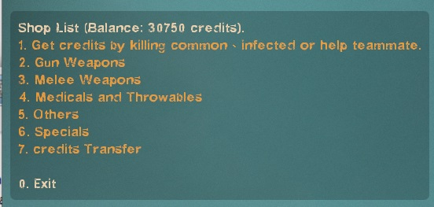
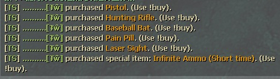
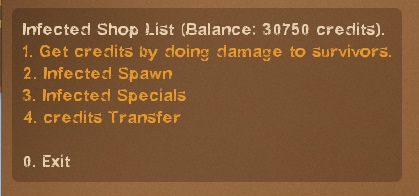

# Description | 內容
L4D2 Human and Zombie Shop by HarryPoter
* (Survivor) Killing zombies and infected to earn credits
* (Infected) Doing Damage to survivors to earn credits

* [Private Version | 新版插件](https://github.com/fbef0102/Game-Private_Plugin/tree/main/Plugin_插件/Fun_娛樂/L4D2_Buy_Store)

* [Video | 影片展示](https://youtu.be/LP0ALxlbaZE)

* Image | 圖示
	* survivor shop list
		> 人類商城
		<br/>
	* survivor shop list
		> 所有玩家的銀行儲值
		<br/>
	* display message
		> 顯示有人購物
		<br/>
	* infectec shop list
		> 特感商城
		<br/>
	* buy command
		> 使用命令直接購物
		<br/>

* Apply to | 適用於
	```
	L4D2
	```

* Translation Support | 支援翻譯
	```
	English
	繁體中文
	简体中文
	Spanish
	Russian
	Portuguese
	Dutch
	```

* <details><summary>Changelog | 版本日誌</summary>

	* 4.6
		* Remke code
		* Translation Support
		* Add The last stand two melee
		* Unlock All weapons including M60, Grenade_Launcher, and CSS weapons
		* Unlock All items including cola, gnome and fireworkcrate
		* Add Infected Shop
		* You can earn credits by doing damage to survivors as an infected.
		* You can earn credits by helping each other as a survivor.
		* Save player's money with Cookies, it means that money can be saved to database across client connections, map changes and even server restarts.
		* Add short buy commands, directly buy item.
		* Repeat purchase item you bought last time.
		* Buy time cooldown, can't buy quickly.
		* No Special Item and database

	* v1.0
		* [By Explait](https://forums.alliedmods.net/showthread.php?t=322108)
</details>

* Require | 必要安裝
	1. [left4dhooks](https://forums.alliedmods.net/showthread.php?t=321696)
	2. [[INC] Multi Colors](https://github.com/fbef0102/L4D1_2-Plugins/releases/tag/Multi-Colors)
	3. To unlock all melee weapons in all campaigns, you MUST use the [Mission and Weapons - Info Editor](https://forums.alliedmods.net/showthread.php?t=310586) plugin which supersedes the extension.

* <details><summary>ConVar | 指令</summary>

	* cfg/sourcemod/L4D2_Buy_Store.cfg
		```php
		// If 1, use CookiesCached to save player money. Otherwise, the moeny will not be saved if player leaves the server.
		sm_shop_CookiesCached_enable "1"

		// Giving money for killing a boomer
		sm_shop_boomkilled "10"

		// Giving money for killing a charger
		sm_shop_chargerkilled "30"

		// Can not buy cola in these maps, separate by commas (no spaces). (0=All maps, Empty = none).
		sm_shop_cola_map_off "c1m2_streets"

		// Giving money for saving people with defibrillator
		sm_shop_defi_save "200"

		// Giving money to each alive survivor for mission accomplished award (final).
		sm_shop_final_mission_complete "3000"

		// Giving money to each infected player for wiping out survivors.
		sm_shop_final_mission_lost "300"

		// Can not buy gas can in these maps, separate by commas (no spaces). (0=All maps, Empty = none).
		sm_shop_gascan_map_off "c1m4_atrium,c6m3_port,c14m2_lighthouse"

		// Giving money for healing people with kit
		sm_shop_heal_teammate "100"

		// Giving money for saving incapacitated people. (No Hanging from legde)
		sm_shop_help_teammate_save "30"

		// Giving money for killing a hunter
		sm_shop_hunterkilled "20"

		// Cold Down Time in seconds an infected player can not buy again after player buys item. (0=off).
		sm_shop_infected_cooltime_block "30.0"

		// If 1, Enable shop for infected.
		sm_shop_infected_enable "1"

		// Giving money for incapacitating a survivor. (No Hanging from legde)
		sm_shop_infected_survivor_incap "30"

		// Giving money for killing a survivor.
		sm_shop_infected_survivor_killed "100"

		// Tank limit on the field before infected can buy a tank. (0=Can't buy Tank)
		sm_shop_infected_tank_limit "1"

		// Infected player must wait until survivors have left start safe area for at least X seconds to buy item. (0=Infected Shop available anytime)
		sm_shop_infected_wait_time "10"

		// Giving money for killing a jockey
		sm_shop_jockeykilled "25"

		// Changes how 'You got credits by killing infected' Message displays. (0: Disable, 1:In chat, 2: In Hint Box, 3: In center text)
		sm_shop_kill_infected_announce_type "1"

		// Maximum money limit. (Money saved when map change/leaving server)
		sm_shop_max_moeny_limit "32000"

		// Numbers of real survivor and infected player require to active this plugin.
		sm_shop_player_require "4"

		// Giving money for killing a smoker
		sm_shop_smokerkilled "20"

		// Giving money for killing a spitter
		sm_shop_spitterkilled "10"

		// Giving money to each alive survivor for mission accomplished award (non-final).
		sm_shop_stage_complete "400"

		// If 1, decrease money if survivor friendly fire each other. (1 hp = 1 dollar)
		sm_shop_survivor_TK_enable "1"

		// Cold Down Time in seconds a survivor player can not buy again after player buys item. (0=off).
		sm_shop_survivor_cooltime_block "5.0"

		// Giving one dollar money for hurting tank per X hp
		sm_shop_tank_hurt "40"

		// Giving money for killing a witch
		sm_shop_witchkilled "80"

		// Giving money for killing a zombie
		sm_shop_zombiekilled "1"
		```
</details>

* <details><summary>Command | 命令</summary>

	* **shop and buy (Short name available)**
		```php
		say "b [item_name]"
		sm_shop [item_name]
		sm_buy [item_name]
		sm_b [item_name]
		sm_money [item_name]
		sm_purchase [item_name]
		sm_market [item_name]
		sm_item [item_name]
		sm_items [item_name]
		sm_credit [item_name]
		sm_credits [item_name]
		```

		* say "!buy" or "b" to open shop menu
		* say "!buy rifle_ak47" or "b rifle_ak47" to directly buy Ak47 weapon
		* **short command list**
		> I won't add more short commands, don't ask
		```php
		Weapon
		{
			"!buy pistol" 				-> Pistol
			"!buy pistol_magnum"		-> Magnum
			"!buy pumpshotgun"			-> Pumpshotgun
			"!buy shotgun_chrome"		-> Chrome Shotgun
			"!buy smg"					-> Smg
			"!buy smg_silenced"			-> Silenced Smg
			"!buy smg_mp5"				-> MP5
			"!buy rifle"				-> Rifle
			"!buy rifle_ak47"			-> AK47
			"!buy rifle_desert"			-> Desert Rifle
			"!buy rifle_sg552"			-> SG552
			"!buy shotgun_spas"			-> Spas Shotgun
			"!buy autoshotgun"			-> Autoshotgun
			"!buy hunting_rifle"		-> Hunting Rifle
			"!buy sniper_military"		-> Military Sniper
			"!buy sniper_scout"			-> SCOUT
			"!buy sniper_awp"			-> AWP
			"!buy rifle_m60"			-> M60 Machine Gun
			"!buy grenade_launcher"		-> Grenade Launcher
		}

		Melee
		{
			"!buy chainsaw"				-> Chainsaw
			"!buy baseball_bat"			-> Baseball Bat
			"!buy cricket_bat"			-> Cricket Bat
			"!buy crowbar"				-> Crowbar
			"!buy electric_guitar"		-> Electric Guitar
			"!buy fireaxe"				-> Fire Axe
			"!buy frying_pan"			-> Frying Pan
			"!buy katana"				-> Katana
			"!buy machete"				-> Machete
			"!buy tonfa"				-> Tonfa
			"!buy golfclub"				-> Golf Club
			"!buy knife"				-> Knife
			"!buy pitchfork"			-> Pitchfork
			"!buy shovel"				-> Shovel
		}

		Medic and Throwable
		{
			"!buy defibrillator"		-> Defibrillator
			"!buy first_aid_kit"		-> First Aid Kit
			"!buy pain_pills"			-> Pain Pill
			"!buy adrenaline"			-> Adrenaline
			"!buy pipe_bomb"			-> Pipe Bomb
			"!buy molotov"				-> Molotov
			"!buy vomitjar"				-> Vomitjar
		}

		Other
		{
			"!buy ammo"								-> Ammo
			"!buy laser_sight"						-> Laser Sight
			"!buy incendiary_ammo"					-> Incendiary Ammo
			"!buy explosive_ammo"					-> Explosive Ammo
			"!buy weapon_upgradepack_incendiary"	-> Incendiary Pack
			"!buy weapon_upgradepack_explosive"		-> Explosive Pack
			"!buy propanetank"						-> Propane Tank
			"!buy oxygentank"						-> Oxygen Tank
			"!buy fireworkcrate"					-> Firework Crate
			"!buy gascan"							-> Gascan
			"!buy cola_bottles"						-> Cola Bottles
			"!buy gnome"							-> Gnome
		}

		Infected Spawn
		{
			"!buy Suicide" 	-> Suicide
			"!buy Smoker" 	-> Smoker
			"!buy Boomer" 	-> Boomer
			"!buy Hunter" 	-> Hunter
			"!buy Spitter" 	-> Spitter
			"!buy Jockey" 	-> Jockey
			"!buy Charger" 	-> Charger
			"!buy Tank" 	-> Tank
		}
		```
	* **repeat purchase item you bought last time**
		```php
		sm_repeatbuy
		sm_lastbuy
		```
	* **donate money to another player (Or use "Credits Transfer" in shop menu)**
		```php
		sm_pay <name> <money>
		sm_donate <name> <money>
		```
	* **See all players' or specific player's deposit**
		```php
		sm_inspectbank [name]
		sm_checkbank [name]
		sm_lookbank [name]
		sm_allbank [name]
		```
	* **Adm gives/reduces money (ADMFLAG_BAN)**
		```php
		sm_givemoney <name> <+-money>
		sm_givecredit <name> <+-money>
		```
	* **Adm removes player's all money (ADMFLAG_BAN)**
		```php
		sm_clearmoney <name>
		sm_deductmoney <name>
		```
</details>

* How to modify the item price
	* L4D2_Buy_Store.sp line 140 ~ 215

* Database
	* ```sm_shop_CookiesCached_enable "1"```, this uses CookiesCached to save player money

- - - -
# 中文說明
人類與特感的購物商城

* 功能
	1. (人類) 殺死特感與小殭屍獲取金額
	2. (特感) 對倖存者造成傷害獲取金額
	3. 自定義各項商品的金額
	4. 自定義獲取的金額
	5. 通關與滅團都有獎勵
	6. 可設置購物冷卻時間
	7. 特感玩家能幫自己購買特感復活，亦能購買Tank
> __Note__ 如要更多功能，[請點我查看新版的購物插件](https://github.com/fbef0102/Game-Private_Plugin/tree/main/Plugin_%E6%8F%92%E4%BB%B6/Fun_%E5%A8%9B%E6%A8%82/L4D2_Buy_Store#%E4%B8%AD%E6%96%87%E8%AA%AA%E6%98%8E)，附有特殊商品與金錢轉移功能以及資料庫功能

* <details><summary>命令中文介紹 (點我展開)</summary>

	* **購物商城**
		```php
		say "b [item_name]"
		sm_shop [item_name]
		sm_buy [item_name]
		sm_b [item_name]
		sm_money [item_name]
		sm_purchase [item_name]
		sm_market [item_name]
		sm_item [item_name]
		sm_items [item_name]
		sm_credit [item_name]
		sm_credits [item_name]
		```

		* 聊天視窗打 !buy 或 b 開啟商城列表
		* 聊天視窗打 !buy rifle_ak47 或 b rifle_ak47 直接購買AK47槍
		* **購物短名列表**
		> 我不會增加更多短名，不要問
		```php
		Weapon
		{
			"!buy pistol" 				-> Pistol
			"!buy pistol_magnum"		-> Magnum
			"!buy pumpshotgun"			-> Pumpshotgun
			"!buy shotgun_chrome"		-> Chrome Shotgun
			"!buy smg"					-> Smg
			"!buy smg_silenced"			-> Silenced Smg
			"!buy smg_mp5"				-> MP5
			"!buy rifle"				-> Rifle
			"!buy rifle_ak47"			-> AK47
			"!buy rifle_desert"			-> Desert Rifle
			"!buy rifle_sg552"			-> SG552
			"!buy shotgun_spas"			-> Spas Shotgun
			"!buy autoshotgun"			-> Autoshotgun
			"!buy hunting_rifle"		-> Hunting Rifle
			"!buy sniper_military"		-> Military Sniper
			"!buy sniper_scout"			-> SCOUT
			"!buy sniper_awp"			-> AWP
			"!buy rifle_m60"			-> M60 Machine Gun
			"!buy grenade_launcher"		-> Grenade Launcher
		}

		Melee
		{
			"!buy chainsaw"				-> Chainsaw
			"!buy baseball_bat"			-> Baseball Bat
			"!buy cricket_bat"			-> Cricket Bat
			"!buy crowbar"				-> Crowbar
			"!buy electric_guitar"		-> Electric Guitar
			"!buy fireaxe"				-> Fire Axe
			"!buy frying_pan"			-> Frying Pan
			"!buy katana"				-> Katana
			"!buy machete"				-> Machete
			"!buy tonfa"				-> Tonfa
			"!buy golfclub"				-> Golf Club
			"!buy knife"				-> Knife
			"!buy pitchfork"			-> Pitchfork
			"!buy shovel"				-> Shovel
		}

		Medic and Throwable
		{
			"!buy defibrillator"		-> Defibrillator
			"!buy first_aid_kit"		-> First Aid Kit
			"!buy pain_pills"			-> Pain Pill
			"!buy adrenaline"			-> Adrenaline
			"!buy pipe_bomb"			-> Pipe Bomb
			"!buy molotov"				-> Molotov
			"!buy vomitjar"				-> Vomitjar
		}

		Other
		{
			"!buy ammo"								-> Ammo
			"!buy laser_sight"						-> Laser Sight
			"!buy incendiary_ammo"					-> Incendiary Ammo
			"!buy explosive_ammo"					-> Explosive Ammo
			"!buy weapon_upgradepack_incendiary"	-> Incendiary Pack
			"!buy weapon_upgradepack_explosive"		-> Explosive Pack
			"!buy propanetank"						-> Propane Tank
			"!buy oxygentank"						-> Oxygen Tank
			"!buy fireworkcrate"					-> Firework Crate
			"!buy gascan"							-> Gascan
			"!buy cola_bottles"						-> Cola Bottles
			"!buy gnome"							-> Gnome
		}

		Infected Spawn
		{
			"!buy Suicide" 	-> Suicide
			"!buy Smoker" 	-> Smoker
			"!buy Boomer" 	-> Boomer
			"!buy Hunter" 	-> Hunter
			"!buy Spitter" 	-> Spitter
			"!buy Jockey" 	-> Jockey
			"!buy Charger" 	-> Charger
			"!buy Tank" 	-> Tank
		}
		```
	* **重複購買上次的商品**
		```php
		sm_repeatbuy
		sm_lastbuy
		```
	* **捐贈金額給其他人 (或在商城列表使用"金錢轉移")**
		```php
		sm_pay <name> <money>
		sm_donate <name> <money>
		```
	* **查看所有玩家的銀行儲值**
		```php
		sm_inspectbank [name]
		sm_checkbank [name]
		sm_lookbank [name]
		sm_allbank [name]
		```
	* **管理員打錢 (權限：ADMFLAG_BAN)**
		```php
		sm_givemoney <name> <+-money>
		sm_givecredit <name> <+-money>
		```
	* **管理員沒收玩家的金錢 (權限：ADMFLAG_BAN)**
		```php
		sm_clearmoney <name>
		sm_deductmoney <name>
		```
</details>

* 如何設定各商品金額
	* 源碼檔案第140到215行

* 資料庫設定
	* 使用指令 ```sm_shop_CookiesCached_enable "1"``` 能幫玩家儲值金額到本地伺服器上