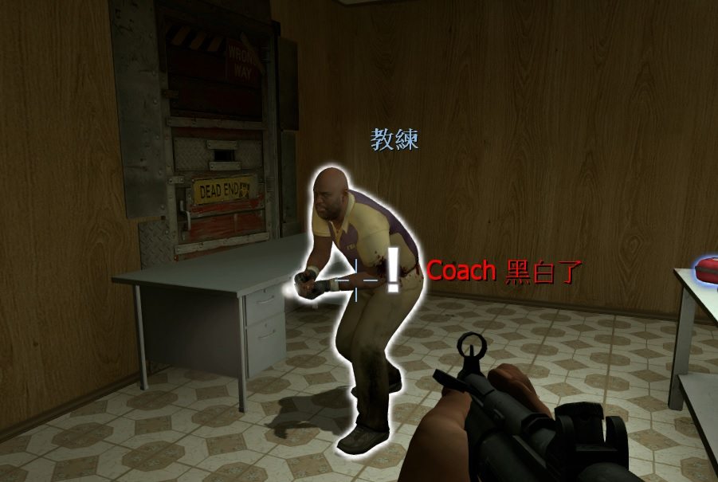
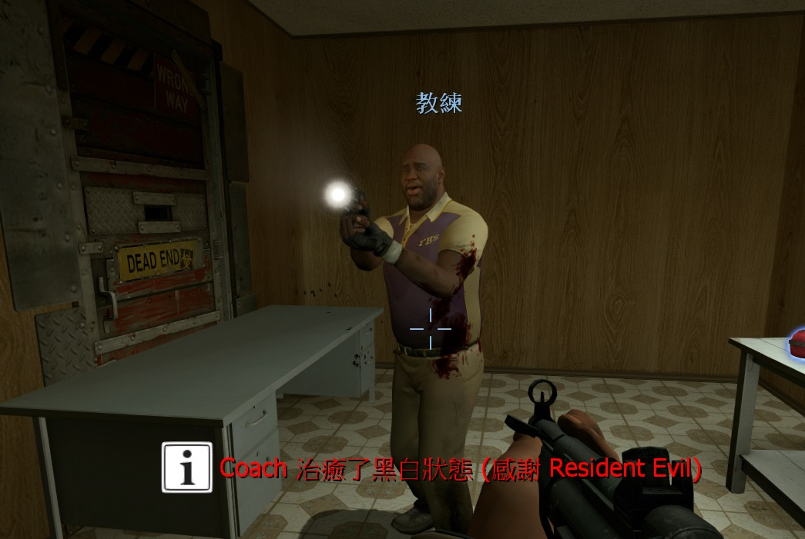

# Description | 內容
Notifies selected team(s) when someone is on final strike and add glow

* Video | 影片展示
<br/>None

* Image | 圖示
    * display who is black and white (顯示哪個玩家黑白)
    <br/>
    * display who healed (顯示誰治癒了黑白)
    <br/>

* Require | 必要安裝
    1. [left4dhooks](https://forums.alliedmods.net/showthread.php?t=321696)
    2. [[INC] Multi Colors](https://github.com/fbef0102/L4D1_2-Plugins/releases/tag/Multi-Colors)

* Similar Plugin | 相似插件
    1. [l4d_blackandwhite](https://github.com/fbef0102/L4D1_2-Plugins/tree/master/l4d_blackandwhite): Notify people when player is black and white.
        > 顯示誰是黑白狀態，比較少的提示與支援

* <details><summary>ConVar | 指令</summary>

    * cfg/sourcemod/LMC_Black_and_White_Notifier.cfg
        ```php
        // Enable black and white notification plugin?(1/0 = yes/no)
        lmc_blackandwhite "1"

        // Enable making black white players glow?(1/0 = yes/no)
        lmc_glow "1"

        // Glow(255 255 255)
        lmc_glowcolour "255 255 255"

        // while black and white if below 20(Def) start pulsing (0 = disable)
        lmc_glowflash "20"

        // Glow range before you don't see the glow max distance
        lmc_glowrange "800.0"

        // Director hint colour Layout(255 255 255)
        lmc_hintcolour "255 0 0"

        // Director hint range On Black and white
        lmc_hintrange "600"

        // Director hint Timeout (in seconds)
        lmc_hinttime "5.0"

        // Type to use for notification. (0= off, 1=chat, 2=hint text, 3=director hint)
        lmc_noticetype "3"

        // Method of notification. (0=survivors only, 1=infected only, 2=all players)
        lmc_teamnoticetype "0"
        ```
</details>

* <details><summary>Command | 命令</summary>
    
    None
</details>

* Apply to | 適用於
    ```
    L4D2
    ```

* <details><summary>Translation Support | 支援翻譯</summary>

    ```
    English
    繁體中文
    简体中文
    ```
</details>

* <details><summary>Changelog | 版本日誌</summary>

    * v1.1h (2023-6-23)
        * Fixed glow disappear when B&W player switches team

    * v1.0h (2022-11-26)
        * Remake Code
        * Converted plugin source to the latest syntax
        * Changes to fix warnings when compiling on SourceMod 1.11.
        * Support Translation
        * Check Last Life every 1.0 second (For people using admin cheats and other stuff that changes survivor health)
    
    * v2.0.2
        * [By Lux](https://forums.alliedmods.net/showthread.php?p=2612147)
</details>

- - - -
# 中文說明
顯示誰是黑白狀態，有更多的提示與支援LMC模組

* 原理
    * 救起玩家之後判定玩家是否為黑白狀態
    * 支援其他恢复玩家血量的插件
    * [LMC模組是由Lux大佬創建的插件](https://forums.alliedmods.net/showthread.php?t=286987)，可以自由切換角色為任何模組

* 功能
    * 哪些人能看到黑白提示
    * 可設置光圈顏色與範圍 (只有二代才能)
    * 可設置導演系統提示 (玩家必須打開遊戲指導系統)