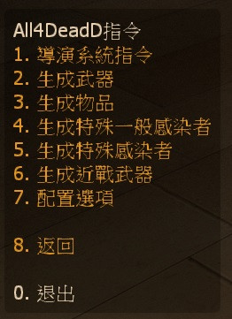

# Description | 內容
Enables admins to have control over the AI Director and spawn all weapons, melee, items, special infected, and Uncommon Infected without using sv_cheats 1

* Video | 影片展示
<br/>None

* Image
    * All 4 Dead
    <br/>

* <details><summary>How does it work?</summary>

    * Type !admin to call adm menu and you will see "ALL4DEAD" option
    * Support custom melee
</details>

* Require | 必要安裝
    1. [left4dhooks](https://forums.alliedmods.net/showthread.php?t=321696)
    2. [[INC] Multi Colors](https://github.com/fbef0102/L4D1_2-Plugins/releases/tag/Multi-Colors)

* <details><summary>ConVar | 指令</summary>

	* cfg\sourcemod\all4dead2.cfg
		```php
        // Whether or not bosses will be forced to spawn all the time.
        a4d_always_force_bosses "0"

        // Whether or not we announce changes in game.
        a4d_notify_players "1"

        // The amount of time in seconds between location refreshes. Used only for placing uncommon infected automatically.
        a4d_refresh_zombie_location "20.0"

        // The amount of zombies to add when an admin requests more zombies.
        a4d_zombies_to_add "10"
		```
</details>

* <details><summary>Command | 命令</summary>

	* **Usage: a4d_spawn_infected <infected_type> (does not work for uncommon infected, use a4d_spawn_uinfected instead)**
        ```php
        a4d_spawn_infected <zombie|mob|witch|tank|boomer|hunter|smoker|spitter|jockey|charger>
        ```

	* **Usage: a4d_spawn_uinfected <uncommon_infected_type>**
        ```php
        a4d_spawn_uinfected <riot|ceda|clown|mud|roadcrew|jimmy>
        ``` 

	* **Usage: a4d_spawn_item <item_type>, read more item [here](https://commands.gg/l4d2/give)**
        ```php
        a4d_spawn_item <rifle|first_aid_kit|ammo....>
        a4d_spawn_weapon <rifle|first_aid_kit|ammo....>
        ``` 

	* **This command forces the AI director to start a panic event**
        ```php
        a4d_force_panic
        ``` 

	* **This command forces the AI director to start a panic event endlessly**
        ```php
        a4d_panic_forever
        ``` 

	* **Usage: a4d_force_tank <0|1>**
        ```php
        a4d_force_tank <0|1>
        ``` 

	* **Usage: a4d_force_witch <0|1>**
        ```php
        a4d_force_witch <0|1>
        ``` 

	* **Usage: a4d_always_force_bosses <0|1>**
        ```php
        a4d_continuous_bosses <0|1>
        ``` 

	* **Usage: a4d_add_zombies <0..99>**
        ```php
        a4d_add_zombies <0~99>
        ``` 

	* **Usage: a4d_enable_notifications <0|1>**
        ```php
        a4d_enable_notifications <0|1>
        ``` 

	* **Usage: Resets all ConVars to their default settings.**
        ```php
        a4d_reset_to_defaults
        ```
</details>

* Apply to | 適用於
    ```
    L4D2
    ```

* Translation Support | 支援翻譯
    ```
    English
    繁體中文
    简体中文
    ```

* <details><summary>Changelog | 版本日誌</summary>

    ```php
    //grandwazir @ 2009-2010
    //Harry @ 2020-2024
    ```
    * v3.7 (2024-1-20)
        * Custom melee spawn support

    * v3.6 (2023-3-11)
        * Fixed translation phrase.

    * v3.5 (2023-1-27)
        * Translation Support. Thanks to wyxls.

    * v3.4
        * [AlliedModder Post](https://forums.alliedmods.net/showpost.php?p=2719391&postcount=503)
        * Convert All codes to new syntax.
        * Add gamedata to support infected spawn (without being limit by director)
        * Add All weapons、melee、items
        * Add firework crate
        * Add L4D2 "The Last Stand" two melee: pitchfork、shovel
        * Spawn Witch Bride Model in c6m1 to prevent crash
        * Add Gnome and Cola.
        * Display menu forever

    * v2.0
        * [Original Plugin by grandwazir](https://forums.alliedmods.net/showthread.php?t=84609)
</details>

- - - -
# 中文說明
管理員可以直接操控遊戲導演系統並生成武器、近戰武器、物品、醫療物品、特殊感染者以及特殊一般感染者等等，無須開啟作弊模式

* 圖示
    * 介面
    <br/>

* 原理
    * 管理員輸入!admin就能看到 "ALL4DEAD" 選項
    * 支援生成三方圖近戰武器

* 用意在哪?
    * 不需要開啟作弊模式就能輕鬆生成各種武器、物品與特感，適合用於服主做測試或惡搞

* 功能
    * 可設置是否通知玩家訊息
    * 可設置每次增加普通感染者的數量


