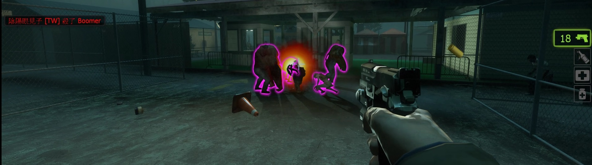
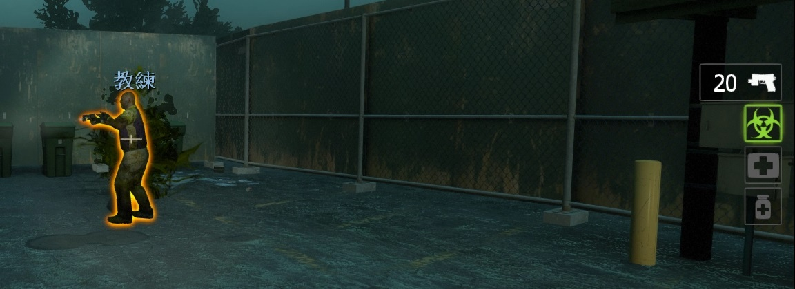

# Description | 內容
Vomit Jars hit Survivors, Boomer Explosions slime Infected.

* [Video | 影片展示](https://youtu.be/jdkrz0vJoXo)

* Image | 圖示
    * Boomer Explosions slime Infected. (Boomer爆炸的膽汁噴到特感身上)
    <br/>
    * Vomit Jars hit Survivors (膽汁瓶會噴到倖存者身上)
    <br/>

* Require | 必要安裝
    1. [left4dhooks](https://forums.alliedmods.net/showthread.php?t=321696)

* <details><summary>ConVar | 指令</summary>

    * cfg/sourcemod/l4d2_biletheworld.cfg
        ```php
        // 0=Plugin off, 1=Plugin on.
        l4d2_biletheworld_enable "1"

        // Turn on Bile the World on Boomer Death to, 1=Common Infected, 2=S.I., 4=Witch, 8=Tank. Add numbers together (0=Disabe, 15=All)
        l4d2_biletheworld_boomer_death_apply "15"

        // Bile Range on Boomer Death.
        l4d2_biletheworld_boomer_death_radius "250"

        // If 1, Turn on Bile the World on Vomit Jar to self.
        l4d2_biletheworld_vomit_jar_self "1"

        // If 1, Turn on Bile the World on Vomit Jar to teammate.
        l4d2_biletheworld_vomit_jar_teammate "1"

        // Bile Range on Vomit Jar.
        l4d2_biletheworld_vomit_jar_radius "150"

        // How much hp reduce, if player throws Vomit Jar to survivors. (0=off)
        l4d2_biletheworld_vomit_teammate_hp "30"
        ```
</details>

* <details><summary>Command | 命令</summary>

    None
</details>

* Apply to | 適用於
    ```
    L4D2
    ```

* <details><summary>Changelog | 版本日誌</summary>

    ```php
    //AtomicStryker @ 2010-2017
    //HarryPotter @ 2022-2024
    ```
    * v1.0h (2024-2-24)
        * Update Cvars

    * v1.3.1 (2022-12-27)
        * [AlliedModder Post](https://forums.alliedmods.net/showpost.php?p=2771151&postcount=124)
        * Remake code
        * Remove gamedata
        * If player throws Vomit Jar to teammate, reduce his hp :D

    * v1.0.7
        * [Original Request by AtomicStryker](https://forums.alliedmods.net/showthread.php?t=132264)
</details>

- - - -
# 中文說明
膽汁瓶會噴到倖存者身上，Boomer爆炸的膽汁噴到特感、Tank、Witch、普通感染者

* 原理
    * 玩家朝隊友丟膽汁瓶，隊友也會被淋到
    * Boomer死亡爆炸時，旁邊如果有特感、Tank、Witch、普通感染者，他們也會被炸到淋上膽汁

* <details><summary>指令中文介紹 (點我展開)</summary>

    * cfg/sourcemod/l4d2_biletheworld.cfg
        ```php
        // 0=關閉插件, 1=啟動插件
        l4d2_biletheworld_enable "1"

        //　Boomer死亡的膽汁影響對象, 1=普通感染者, 2=特感, 4=Witch, 8=Tank. 請將數字相加起來 (0=關閉, 15=全部)
        l4d2_biletheworld_boomer_death_apply "15"

        // Boomer死亡的膽汁影響範圍
        l4d2_biletheworld_boomer_death_radius "250"

        // 為1時，自己丟的膽汁瓶也會被淋到
        l4d2_biletheworld_vomit_jar_self "1"

        // 為1時，朝隊友丟膽汁瓶，隊友也會被淋到
        l4d2_biletheworld_vomit_jar_teammate "1"

        // 膽汁瓶的膽汁影響範圍
        l4d2_biletheworld_vomit_jar_radius "150"

        // 如果玩家朝隊友丟膽汁瓶，丟膽汁瓶的玩家會受到懲罰減少HP，可設置扣除的HP數值 (0=關閉這項功能)
        l4d2_biletheworld_vomit_teammate_hp "30"
        ```
</details>

