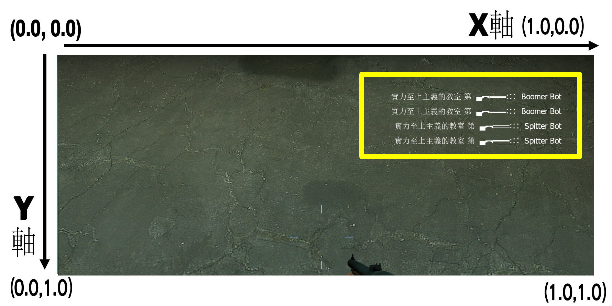

# Description | 內容
HUD with cs kill info list.

* [Video | 影片展示](https://youtu.be/Cehi0IxaCpI)

* Image | 圖示
    * 【L4D2】 (●｀・ω・)=Ｏ)｀-д゜)【你】
    <br/>
    <br/>

* Require | 必要安裝
<br/>None

* <details><summary>ConVar | 指令</summary>

    * cfg/sourcemod/l4d2_cs_kill_hud.cfg
        ```php
        // 0=Plugin off, 1=Plugin on.
        l4d2_cs_kill_hud_enable "1"

        // Numbers of kill list on hud (Default: 5, MAX: 6)
        l4d2_cs_kill_hud_number "5"

        // Time in seconds to erase kill list on hud.
        l4d2_cs_kill_hud_notice_time "7"

        // If 1, disable offical player death message (the red font of kill info)
        l4d2_cs_kill_hud_disable_standard_message "1"

        // X (horizontal) position of the kill list.
        // Note: setting it to less than 0.0 may cut/hide the text at screen.
        l4d2_cs_kill_hud_x "0.5"

        // Y (vertical) position of the kill list.
        // Note: setting it to less than 0.0 may cut/hide the text at screen.
        l4d2_cs_kill_hud_y "0.1"

        // Text area Width.
        l4d2_cs_kill_hud_width "0.49"

        // Text area Height.
        l4d2_cs_kill_hud_height "0.04"

        // Aligns the text horizontally.
        // 1 = LEFT, 2 = CENTER, 3 = RIGHT.
        l4d2_cs_kill_hud_text_align "3"

        // Which team should see the text.
        // 0 = ALL, 1 = SURVIVOR, 2 = INFECTED.
        l4d2_cs_kill_hud_team "0"

        // If 1, Makes the text blink from white to red.
        l4d2_cs_kill_hud_blink "1"

        // If 1, Shows the text inside a black transparent background.
        // Note: the background may not draw properly when initialized as "0", start the map with "1" to render properly.
        l4d2_cs_kill_hud_background "0"
        ```
</details>

* <details><summary>Command | 命令</summary>

    None
</details>

* <details><summary>FAQ</summary>

    * How to customize weapon icon?
        * [l4d2_cs_kill_hud.sp](/l4d2_cs_kill_hud/scripting/l4d2_cs_kill_hud.sp#L141-L184) line 141 ~ 184
        * Recompile, done.

    * How to switch HUD position?
        * Modify ```l4d2_cs_kill_hud_x``` cvar
        * Modify ```l4d2_cs_kill_hud_y``` cvar
        * Coordinate diagram
        <br/>
</details>

* <details><summary>Known Conflicts</summary>
    
    If you don't use any of these at all, no need to worry about conflicts.
    1. [Mod - Admin System](https://steamcommunity.com/sharedfiles/filedetails/?id=214630948)
        * Please Remove
</details>

* Apply to | 適用於
    ```
    L4D2
    ```

* <details><summary>Related Plugin | 相關插件</summary>

    1. [l4d2_scripted_hud](https://github.com/fbef0102/Game-Private_Plugin/tree/main/Plugin_插件/Server_伺服器/l4d2_scripted_hud): Display text for up to 5 scripted HUD slots on the screen.
        * 在玩家畫面上方五個Hud位置顯示不同的特殊文字
    2. [l4d2_kills_manager](https://github.com/fbef0102/Game-Private_Plugin/tree/main/Plugin_插件/Special_Infected_特感/l4d2_kills_manager): Sets the real killer of a special infected, based on who inflicted the most damage, instead of last shot.
        * 強制將特感擊殺者改成造成傷害最多的玩家
</details>

* <details><summary>Changelog | 版本日誌</summary>

    * v1.8h (2024-3-28)
        * Add system attacker

    * v1.7h (2024-3-20)
        * Add falling from roof

    * v1.6h (2024-3-8)
        * Update cvars

    * v1.5h (2023-9-12)
        * Add chainsaw

    * v1.4h (2023-6-11)
        * Shows the text inside a black transparent background.
        * Remove headshot or behind wall text if weapon is "pipe bomb", "fire", "melee punch"

    * v1.2h (2023-6-2)
        * Fixed common infected null string

    * v1.1h (2023-6-2)
        * Support Versus mode and witch killed

    * v1.0h (2023-5-28)
        * Merge inc with main sp file
        * Delete all functions, only cs kill info
        * Optimize code and improve performance
        * Add more convars
        * Makes the text blink from white to red.
        * Numbers of kill list on hud
        * Hud will vanish after period time

    * v1.0.3
        * [Original Plugin by LinLinLin](https://forums.alliedmods.net/showthread.php?t=340601)
</details>

- - - -
# 中文說明
L4D2擊殺提示改成CS遊戲的擊殺列表

* 原理
    * 人類或特感死亡時，依據兇手與武器，顯示出不同的提示在右上角
    * 自殺、Witch抓死人、被小殭屍圍毆致死，也會有提示
    * 穿牆、爆頭，新增額外提示
    * 經過一段時間提示會消失

* <details><summary>指令中文介紹 (點我展開)</summary>

    * cfg/sourcemod/l4d2_cs_kill_hud.cfg
        ```php
        // 0=關閉插件, 1=啟動插件
        l4d2_cs_kill_hud_enable "1"

        // 一次最多顯示的擊殺行數 (預設: 5, 最大: 6)
        l4d2_cs_kill_hud_number "5"

        // 擊殺列表顯示停留的時間.
        l4d2_cs_kill_hud_notice_time "7"

        // 為1時，關閉L4D2官方的擊殺提示 (左方紅字黑框的HUD)
        l4d2_cs_kill_hud_disable_standard_message "1"

        // 擊殺列表的X軸位置
        // 注意: 數值低於0可能會導致文字被切掉
        l4d2_cs_kill_hud_x "0.5"

        // 擊殺列表的Y軸位置
        // 注意: 數值低於0可能會導致文字被切掉
        l4d2_cs_kill_hud_y "0.1"

        // 文字框的寬度
        // 非文字變大
        l4d2_cs_kill_hud_width "0.49"

        // 文字框的高度
        // 非文字變大
        l4d2_cs_kill_hud_height "0.04"

        // 文字水平排版
        // 1 = 置左, 2 = 置中, 3 = 置右.
        l4d2_cs_kill_hud_text_align "3"

        // 哪些隊伍能看到擊殺列表
        // 0 = 全部, 1 = 倖存者, 2 = 特感.
        l4d2_cs_kill_hud_team "0"

        // 為1時，擊殺列表文字紅白閃爍
        l4d2_cs_kill_hud_blink "1"

        // 為1時，擊殺列表顯示黑底背景
        // 注意: 修改這項指令可能要重啟地圖才會生效
        l4d2_cs_kill_hud_background "0"
        ```
</details>

* <details><summary>問題區</summary>

    * 如何自製武器圖案?
        * [l4d2_cs_kill_hud.sp](/l4d2_cs_kill_hud/scripting/l4d2_cs_kill_hud.sp#L141-L184) 141 ~ 184 行
        * 重新編譯，完成

    * 如何改變 HUD 位置?
        * 修改 ```l4d2_cs_kill_hud_x``` 指令
        * 修改 ```l4d2_cs_kill_hud_y``` 指令
        * 座標圖
        <br/>
</details>

* <details><summary>會衝突的插件or模組</summary>
    
    如果沒安裝以下內容就不需要擔心衝突
    1. [Mod - Admin System](https://steamcommunity.com/sharedfiles/filedetails/?id=214630948)
        * 請移除
</details>