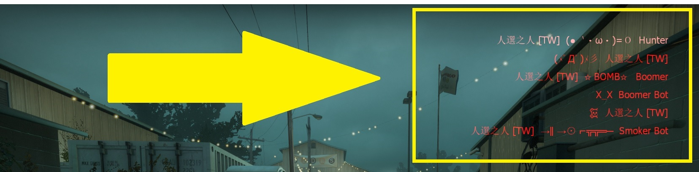

# Description | 內容
HUD with cs kill info list.

* [Video | 影片展示](https://youtu.be/Cehi0IxaCpI)

* Image | 圖示
	* CS kill info list
		> 右上角擊殺提示 (仿CS遊戲)
		<br/>
	* Custom icon
		> 【L4D2】 (●｀・ω・)=Ｏ)｀-д゜)【你】
		<br/>

* Apply to | 適用於
    ```
    L4D2
    ```

* <details><summary>Changelog | 版本日誌</summary>

    * v1.0h (2023-5-28)
        * Merge inc with main sp file
        * Delete all functions, only cs kill info
        * Optimize code and improve performance
        * Add more convars
        * Makes the text blink from white to red.
        * Numbers of kill list on hud
        * Hud will vanish after period time

	* v1.0.3
	    * [Original Plugin by LinLinLin](https://forums.alliedmods.net/showthread.php?t=340601)
</details>

* Require | 必要安裝
 <br/>None

* Related Plugin | 相關插件
	1. [l4d2_scripted_hud](https://github.com/fbef0102/Game-Private_Plugin/tree/main/Plugin_%E6%8F%92%E4%BB%B6/Server_%E4%BC%BA%E6%9C%8D%E5%99%A8/l4d2_scripted_hud): Display text for up to 5 scripted HUD slots on the screen.
		> 在玩家畫面上方五個Hud位置顯示不同的特殊文字

* <details><summary>ConVar | 指令</summary>

	* cfg/sourcemod/l4d2_cs_kill_hud.cfg
        ```php
        // If 1, Makes the text blink from white to red.
        l4d2_cs_kill_hud_blink "1"

        // If 1, disable offical player death message (the red font of kill info)
        l4d2_cs_kill_hud_disable_standard_message "1"

        // 0=Plugin off, 1=Plugin on.
        l4d2_cs_kill_hud_enable "1"

        // Time in seconds to erase kill list on hud.
        l4d2_cs_kill_hud_notice_time "7"

        // Numbers of kill list on hud (Default: 5, MAX: 7)
        l4d2_cs_kill_hud_number "5"
        ```
</details>

* <details><summary>Command | 命令</summary>

	None
</details>

* How to customize weapon icon
	* [l4d2_cs_kill_hud.sp](/l4d2_cs_kill_hud/scripting/l4d2_cs_kill_hud.sp#L137-L171) line 137 ~ 171
    * Recompile, done.

- - - -
# 中文說明
L4D2擊殺提示改成CS遊戲的擊殺列表

* 原理
	* 人類或特感死亡時，依據兇手與武器，顯示出不同的提示在右上角
    * 自殺、Witch抓死人、被小殭屍圍毆致死，也會有提示
    * 穿牆、爆頭，新增額外提示
    * 經過一段時間提示會消失
    * 阻擋L4D2官方的擊殺提示 (左方紅字黑框的HUD)

* 功能
    * 擊殺列表顯示停留的時間
    * 最多可顯示的擊殺數量
    * 文字紅白閃爍

* 自製武器圖案
	* [l4d2_cs_kill_hud.sp](/l4d2_cs_kill_hud/scripting/l4d2_cs_kill_hud.sp#L137-L171) 137 ~ 171 行
    * 重新編譯，完成