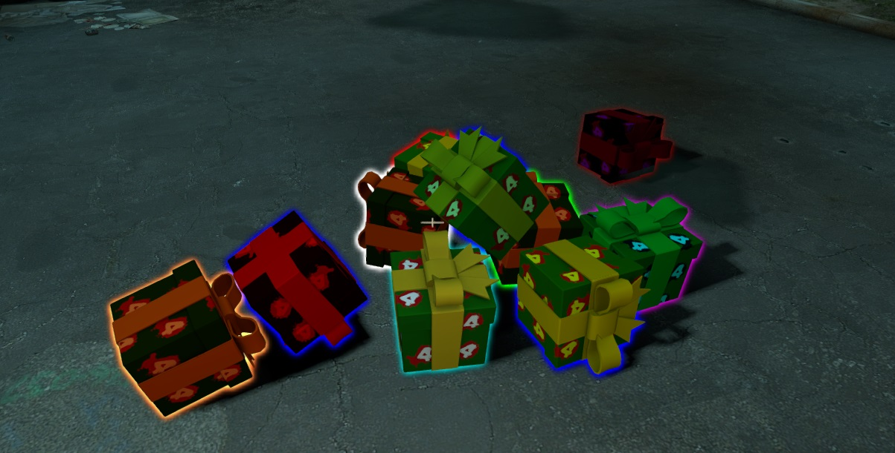

# Description | 內容
Drop gifts (touch gift to earn reward) when a special infected or a witch/tank killed by survivor.

* [Video | 影片展示](https://youtu.be/komzEmVvtH0)

* Image | 圖示
	* Drop Gifts
		> 掉落禮物
		<br/>

* Apply to | 適用於
```
L4D2
```

* Translation Support | 支援翻譯
```
English
繁體中文
简体中文
```

* <details><summary>Changelog | 版本日誌</summary>

	```php
	//[X]Aceleracion @ 2017
	//HarryPotter @ 2022
	```
    * v2.9 (2022-12-2)
		* Add cvars to control glow color and range
		* Translation Support

    * v2.8
		* Remake Code
		* Remove rotation, and some static models
		* Add L4D2 "The Last Stand" two melee: pitchfork、shovel
		* Add All weapons、melee、items
		* Add laser、firework crate、ammo、incendiary ammo、explosive_ammo
		* Use left4dhooks instead
		* Remove points
		* Add glow flashing

	* v1.3.6.1
		* [Original Plugin by Aceleracion](https://forums.alliedmods.net/showthread.php?t=302731)
</details>

* Require | 必要安裝
	1. [left4dhooks](https://forums.alliedmods.net/showthread.php?t=321696)
	2. [Mission and Weapons - Info Editor]("https://forums.alliedmods.net/showthread.php?t=310586"): To unlock all melee weapons in all campaigns

* <details><summary>ConVar | 指令</summary>

    * cfg/sourcemod/l4d2_gifts.cfg
		```php
		// Notify Server who pickes up gift, and what the gift reward is. (0: Disable, 1:In chat, 2: In Hint Box, 3: In center text)
		l4d2_gifts_announce_type "3"

		// Chance (%) of infected drop special standard gift.
		l4d2_gifts_chance "50"

		// Enable gifts 0: Disable, 1: Enable
		// Maximum: "1.000000"
		l4d2_gifts_enabled "1"

		// How long the gift stay on ground (seconds)
		l4d2_gifts_gift_life "30"

		// Standard gift glow color. Three values between 0-255 separated by spaces. RGB Color255 - Red Green Blue.
		// -1 -1 -1: Random
		l4d2_gifts_glow_color "-1 -1 -1"

		// Standard gift glow range.
		l4d2_gifts_glow_range "600"

		// Increase Infected health if they pick up gift. (0=Off)
		l4d2_gifts_infected_reward_hp "200"

		// Maximum of gifts that all survivors can pick up per map [0 = Disabled]
		l4d2_gifts_maxcollectMap "0"

		// Maximum of gifts that all survivors can pick up per round [0 = Disabled]
		l4d2_gifts_maxcollectRound "0"

		// Increase Infected health if they pick up special gift. (0=Off)
		l4d2_gifts_special_infected_reward_hp "400"

		// Chance (%) of tank and witch drop second special gift.
		l4d2_specail_gifts_chance "100"

		// Special gift glow range.
		l4d2_specail_gifts_glow_range "600"

		// Special gift glow color. Three values between 0-255 separated by spaces. RGB Color255 - Red Green Blue.
		// -1 -1 -1: Random
		l4d2_special_gifts_glow_color "-1 -1 -1"
		```
</details>

* <details><summary>Command | 命令</summary>
    
	* **View number of gifts collected**
		```php
		sm_giftcollect
		sm_giftc
		```

	* **Spawn a gift in your position (Adm required: ADMFLAG_CHEATS)**
		```php
		sm_gifts <standard or special>
		```

	* **Reload the config file of gifts (data/l4d2_gifts.cfg)**
		```php
		sm_reloadgifts
		```
</details>

* How to modify the gift Model
	* data\l4d2_gifts.cfg
		```php
		"1"
		{
			"model"		"models/items/l4d_gift.mdl"  //model of gift: a small model such as animals, boxes, etc. is preferable.
			"type"		"physics" 					// type of model: physics or static (Not all models can be physical)
			"gift"		"special" 					// type of gift: standard or special
			"scale"		"1.0"	  					// scale of model (default 1.0) [optional] (Not all models accept scale)
		}
		```

* How to modify the gift item
	* Standard Gift: l4d2_gifts.sp line 38
	* Special Gift: l4d2_gifts.sp line 104
	> __Note__ Recompile after modify

- - - -
# 中文說明
殺死特感會掉落禮物盒，會獲得驚喜物品，聖誕嘉年華

* 原理
    * 特感死亡時會掉落禮物盒，人類只要碰觸到便會自動拆開
	* 禮物盒會有各式各樣的武器與物品，也有可能為空，驚喜一瞬間
	* 特感也能碰到禮盒，會增加血量

* 功能
	1. 殺死特感掉落普通禮盒，殺死Tank或Witch掉落特殊禮盒
    2. 可調整禮盒的顏色與發光範圍
    3. 可調整禮盒的存活時間，如果沒有人撿起會自動消失
    4. 可調整特感碰到禮盒獲得的血量

* 如何修改禮盒模組
	* data\l4d2_gifts.cfg
		```php
		"1"
		{
			"model"		"models/items/l4d_gift.mdl"  //禮盒模型
			"type"		"physics" 					// 禮盒的物理效果: physics[能移動] 或是 static[固態] (非所有模組能接受physics)
			"gift"		"special" 					// 禮盒種類: standard[普通禮盒] or special[特殊禮盒]
			"scale"		"1.0"	  					// 禮盒模型尺寸 (預設是 1.0，非所有模組能改變尺寸)
		}
		```

* 如何設定禮盒驚喜物品
	* 普通禮盒: l4d2_gifts.sp 第38行開始
	* 特殊禮盒: l4d2_gifts.sp 第104行開始
	> __Note__ 修改完後必須重新編譯
