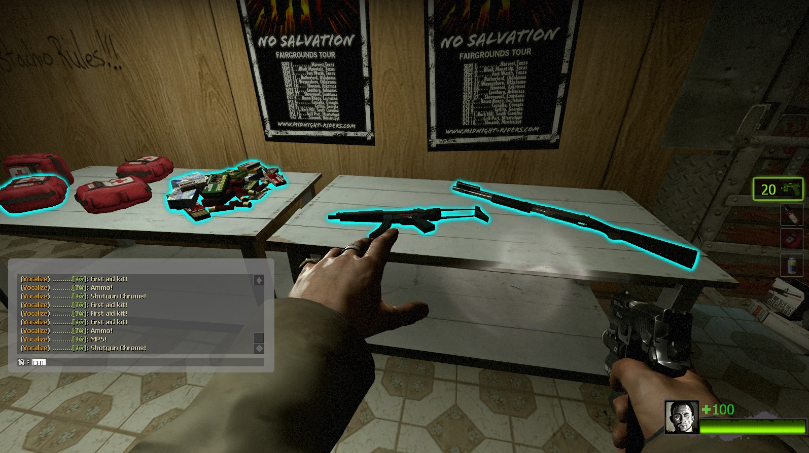
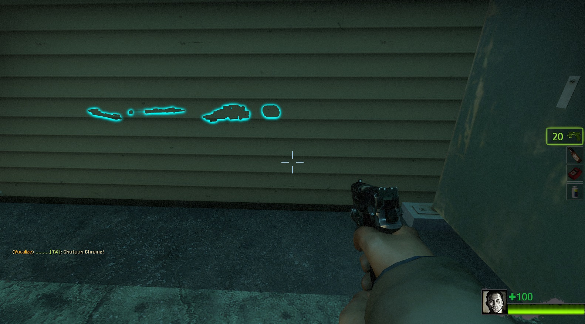
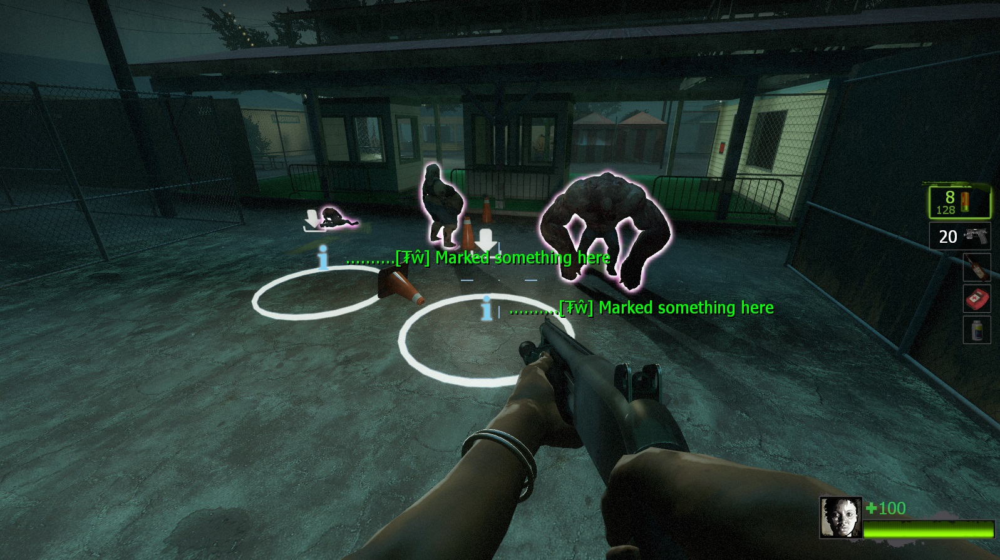
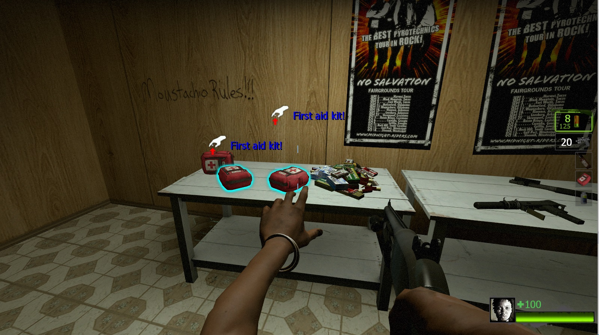
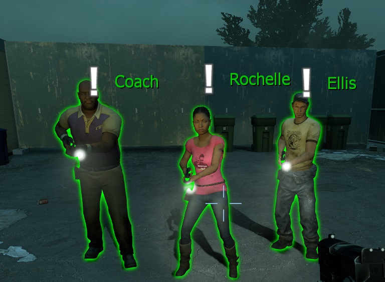
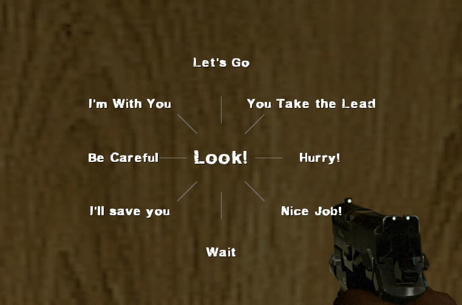
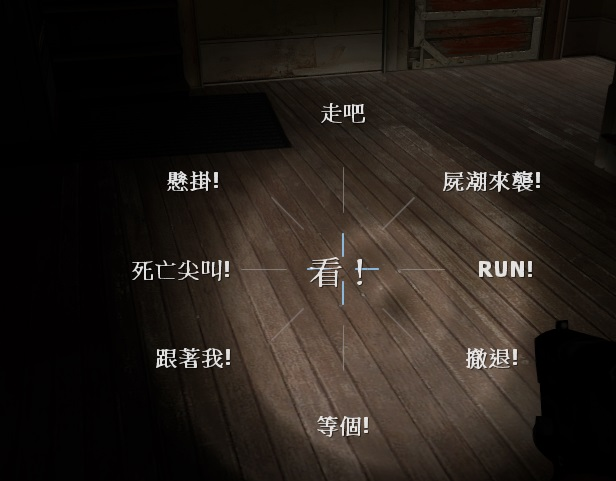

# Description | 內容
When using 'Look' in vocalize menu, print corresponding item to chat area and make item glow or create spot marker/infeced maker like back 4 blood.

* [Video | 影片展示](https://youtu.be/YkMDgmmoyts)

* Image | 圖示
    * Mark weapons and items (標記武器與物品)
    <br/>
    <br/>
    * Mark place and infected (標記地點與特殊感染者)
    <br/>
    * Support director hint (支援指導系統圖案提示)
    <br/>
    * Mark your teammates (標記隊友)
    <br/>

* <details><summary>How does it work?</summary>

    * 'Look' in vocalize menu, mark any weapons, items, infected and spots
    <br/>
    * The infected is unable to mark and see the mark
    * You can also type```!mark``` to mark anything
</details>

* Require | 必要安裝
    1. [Use Priority Patch](https://forums.alliedmods.net/showthread.php?t=327511)
    2. [[INC] Multi Colors](https://github.com/fbef0102/L4D1_2-Plugins/releases/tag/Multi-Colors)

* <details><summary>Important</summary>

    * Hats and others attaching stuff to players could block the players "use" function, which makes you unable to use 'look' item hint. Install [Use Priority Patch](https://forums.alliedmods.net/showthread.php?t=327511) plugin to fix.
    * Player must Enabled GAME INSTRUCTOR, in ESC -> Options -> Multiplayer, or they can't see the hint
    <br/>
    * DO NOT modify convar ```sv_gameinstructor_disable``` this force all clients to disable their game instructors.
</details>

* <details><summary>ConVar | 指令</summary>

    * cfg/sourcemod/l4d2_item_hint.cfg
        * Item Hint
            ```php
            // Item Glow Color, Three values between 0-255 separated by spaces. (Empty = Disable Item Glow)
            l4d2_item_hint_glow_color "0 255 255"

            // Cold Down Time in seconds a player can use 'Look' Item Hint again.
            l4d2_item_hint_cooldown_time "1.0"

            // How close can a player use 'Look' item hint.
            l4d2_item_hint_use_range "150"

            // Item Hint Sound. (relative to to sound/, Empty = OFF)
            l4d2_item_hint_use_sound "buttons/blip1.wav"

            // Changes how Item Hint displays. (0: Disable, 1:In chat, 2: In Hint Box, 3: In center text)
            l4d2_item_hint_announce_type "1"

            // Item Glow Time.
            l4d2_item_hint_glow_timer "10.0"

            // Item Glow Range.
            l4d2_item_hint_glow_range "800"

            // If 1, Create instructor hint on marked item.
            l4d2_item_instructorhint_enable "1"

            // Instructor hint color on marked item. (If empty, off the item name display)
            l4d2_item_instructorhint_color "0 255 255"

            //Instructor icon name on marked item. (For more icons: https://developer.valvesoftware.com/wiki/Env_instructor_hint)
            l4d2_item_instructorhint_icon "icon_interact"
            ```
            
        * Spot Marker
            ```php
            // Spot Marker Glow Color, Three values between 0-255 separated by spaces. (Empty = Disable Spot Marker)
            l4d2_spot_marker_color "200 200 200"

            // Cold Down Time in seconds a player can use 'Look' Spot Marker again.
            l4d2_spot_marker_cooldown_time "2.5"

            // How far away can a player use 'Look' Spot Marker.
            l4d2_spot_marker_use_range "1800"

            // Spot Marker Sound. (relative to to sound/, Empty = OFF)
            l4d2_spot_marker_use_sound "buttons/blip1.wav"

            // Changes how Spot Marker Hint displays. (0: Disable, 1:In chat, 2: In Hint Box, 3: In center text)
            l4d2_spot_marker_announce_type "0"

            // Spot Marker Duration.
            l4d2_spot_marker_duration "10.0"

            // Spot Marker Sprite model. (Empty=Disable)
            l4d2_spot_marker_sprite_model "materials/vgui/icon_arrow_down.vmt"

            // If 1, Create instructor hint on Spot Marker.
            l4d2_spot_marker_instructorhint_enable "1"

            // Instructor hint color on Spot Marker. (If empty, off the hint text display)
            l4d2_spot_marker_instructorhint_color "200 200 200"

            // Instructor icon name on Spot Marker.
            l4d2_spot_marker_instructorhint_icon "icon_info"
            ```

        * Infected Marker
            ```php
            // Infected Marker Glow Color, Three values between 0-255 separated by spaces. (Empty = Disable Infected Marker)
            l4d2_infected_marker_glow_color "255 120 203"

            // Cold Down Time in seconds a player can use 'Look' Infected Marker again.
            l4d2_infected_marker_cooldown_time "0.25"

            // How far away can a player use 'Look' Infected Marker.
            l4d2_infected_marker_use_range "1800"

            // Infected Marker Sound. (relative to to sound/, Empty = OFF)
            l4d2_infected_marker_use_sound "items/suitchargeok1.wav"

            // Changes how infected marker hint displays. (0: Disable, 1:In chat, 2: In Hint Box, 3: In center text)
            l4d2_infected_marker_announce_type "1"

            // Infected Marker Glow Time.
            l4d2_infected_marker_glow_timer "10.0"

            // Infected Marker Glow Rang
            l4d2_infected_marker_glow_range "2500"

            // If 1, Enable 'Look' Infected Marker on witch.
            l4d2_infected_marker_witch_enable "1"

            // If 1, Create instructor hint on Infected's head if marked.
            l4d2_infected_marker_instructorhint_enable "1"

            // Instructor hint color on Infecfed Marker. (If empty, off the zombie class display)
            l4d2_infected_marker_instructorhint_color "255 0 0"

            // Instructor icon name on Infecfed Marker.
            l4d2_infected_marker_instructorhint_icon "icon_skull"
            ```

        * Survivor Marker
            ```php
            // Survivor Marker Glow Color, Three values between 0-255 separated by spaces. (Empty = Disable Infected Marker)
            l4d2_survivor_marker_glow_color "0 200 0"

            // Cold Down Time in seconds a player can use 'Look' Survivor Marker again.
            l4d2_survivor_marker_cooldown_time "1.0"

            // How far away can a player use 'Look' Survivor Marker.
            l4d2_survivor_marker_use_range "1000"

            // Survivor Marker Sound. (relative to to sound/, Empty = OFF)
            l4d2_survivor_marker_use_sound "player/suit_denydevice.wav"

            // Changes how Survivor marker hint displays. (0: Disable, 1:In chat, 2: In Hint Box, 3: In center text)
            l4d2_survivor_marker_announce_type "1"

            // Survivor Marker Glow Time.
            l4d2_survivor_marker_glow_timer "10.0"

            // Survivor Marker Glow Range
            l4d2_survivor_marker_glow_range "2000"

            // If 1, Create instructor hint on Survivor's head if marked.
            l4d2_survivor_marker_instructorhint_enable "1"

            // Instructor hint color on Survivor Marker. (If empty, off the name display)
            l4d2_survivor_marker_instructorhint_color "0 200 0"

            // Instructor icon name on Survivor Marker.
            l4d2_survivor_marker_instructorhint_icon "icon_alert"
            ```
</details>

* <details><summary>Command | 命令</summary>

    * **Mark item/infected/spot**
        ```php
        sm_mark
        ```
</details>

* Apply to | 適用於
    ```
    L4D2
    ```

* Translation Support | 支援翻譯
    ```
    English
    繁體中文
    简体中文
    ```

* <details><summary>Related Plugin | 相關插件</summary>

	1. [l4d2_infected_hp_hint](https://github.com/fbef0102/Game-Private_Plugin/tree/main/Plugin_%E6%8F%92%E4%BB%B6/Special_Infected_%E7%89%B9%E6%84%9F/l4d2_infected_hp_hint): Display corresponding health value hint of all Special Infected
        * 在特感身上顯示剩餘血量
</details>

* <details><summary>Changelog | 版本日誌</summary>

    * v3.1 (2024-6-11)
        * Add Survivor marker, support custom survivor model
        * Update translation

    * v3.0 (2024-3-6)
        * Custom infected model
        * Custom witch model
        * Update translation

    * v2.9 (2024-3-3)
        * Custom melee model
        * Custom ammo model
        * Update translation

    * v2.8 (2024-2-23)
        * Fixed spot maker error

    * v2.7 (2023-3-18)
        * Add spot maker announce

    * v2.6 (2023-3-8)
        * Translation Support

    * v2.5 (2022-12-27)
        * Add MultiColors

    * v2.4 (2022-12-24)
        * Add Command ```sm_mark```, Mark item/infected/spot for people who don't have 'Look' in vocalize menu

    * v2.3 (2022-10-02)
        * [AlliedModders Post](https://forums.alliedmods.net/showpost.php?p=2765332&postcount=30)
        * Add all gun weapons, melee weapons, minigun, ammo and items.
        * Add cooldown.
        * Add Item Glow, everyone can see the item through wall.
        * Add sound.
        * Fixes custom vocalizers that uses SmartLook with capitals.
        * Add Spot Marker, using 'Look' in vocalize menu to mark the area.
        * Add Infected Marker, using 'Look' in vocalize menu to mark the infected.
        * Add Instructor hint, display instructor hint on Spot Marker/Item Hint
        * Marker priority: Infected maker > Item hint > Spot marker

    * v0.2
        * [Original Post by fdxx](https://forums.alliedmods.net/showthread.php?t=333669)
</details>

- - - -
# 中文說明
使用語音雷達"看"可以標記任何物品、武器、地點、特感

* 原理
    * 使用角色語音雷達"看"，可以標記準心指向的任何東西
    <br/>
    * 特感看不見人類標記的光圈、標記提示，也聽不見標記音校
    * 輸入```!mark```也可以標記準心指向的任何東西

* 注意事項
    * 如果有其他插件會擋住視野的裝飾品譬如帽子插件，你可能無法使用標記功能，請安裝[Use Priority Patch](https://forums.alliedmods.net/showthread.php?t=327511)以修正
    * 玩家必須啟動[遊戲指導系統](https://github.com/fbef0102/Game-Private_Plugin/tree/main/Tutorial_%E6%95%99%E5%AD%B8%E5%8D%80/Chinese_%E7%B9%81%E9%AB%94%E4%B8%AD%E6%96%87/Game#%E5%95%9F%E5%8B%95%E9%81%8A%E6%88%B2%E6%8C%87%E5%B0%8E%E7%B3%BB%E7%B5%B1)，否則玩家看不見標記提示
    * 伺服器端不要修改指令 ```sv_gameinstructor_disable```，這會關閉所有玩家的遊戲指導系統

* <details><summary>指令中文介紹 (點我展開)</summary>

    * cfg/sourcemod/l4d2_item_hint.cfg
        * 物品、武器標記
            ```php
            // 標記的光圈顏色，填入RGB三色 (三個數值介於0~255，需要空格)
            // 空=關閉此標記
            l4d2_item_hint_glow_color "0 255 255"

            // 玩家可以再次標記的時間間隔
            l4d2_item_hint_cooldown_time "1.0"

            // 能標記的距離
            l4d2_item_hint_use_range "150"

            // 標記音效. (路徑相對於sound資料夾, 空 = 無音效)
            l4d2_item_hint_use_sound "buttons/blip1.wav"

            // 標記提示該如何顯示. (0: 不提示, 1: 聊天框, 2: 黑底白字框, 3: 螢幕正中間)
            l4d2_item_hint_announce_type "1"

            // 標記的光圈顯示時間
            l4d2_item_hint_glow_timer "10.0"

            // 標記的光圈可見範圍
            l4d2_item_hint_glow_range "800"

            // 為1時，啟用導演提示
            l4d2_item_instructorhint_enable "1"

            // 導演提示的文字顏色 (空=無文字)
            l4d2_item_instructorhint_color "0 255 255"

            // 導演提示的圖案 (查找更多圖案: https://developer.valvesoftware.com/wiki/Env_instructor_hint)
            l4d2_item_instructorhint_icon "icon_interact"
            ```
            
        * 地點標記
            ```php
            // 標記的光圈顏色，填入RGB三色 (三個數值介於0~255，需要空格)
            // 空=關閉此標記
            l4d2_spot_marker_color "200 200 200"

            // 玩家可以再次標記的時間間隔
            l4d2_spot_marker_cooldown_time "2.5"

            // 能標記的距離
            l4d2_spot_marker_use_range "1800"

            // 標記音效. (路徑相對於sound資料夾, 空 = 無音效)
            l4d2_spot_marker_use_sound "buttons/blip1.wav"

            // 標記提示該如何顯示. (0: 不提示, 1: 聊天框, 2: 黑底白字框, 3: 螢幕正中間)
            l4d2_spot_marker_announce_type "0"

            // 標記的光圈顯示時間
            l4d2_spot_marker_duration "10.0"

            // 標記的中心模型圖案 (空=無中心模型圖案)
            l4d2_spot_marker_sprite_model "materials/vgui/icon_arrow_down.vmt"

            // 為1時，啟用導演提示
            l4d2_spot_marker_instructorhint_enable "1"

            // 導演提示的文字顏色 (空=無文字)
            l4d2_spot_marker_instructorhint_color "200 200 200"

            // 導演提示的圖案 
            l4d2_spot_marker_instructorhint_icon "icon_info"
            ```

        * 特感標記
            ```php
            // 特感標記的光圈顏色，填入RGB三色 (三個數值介於0~255，需要空格)
            // 空=關閉此標記
            l4d2_infected_marker_glow_color "255 120 203"

            // 玩家可以再次標記特感的時間間隔
            l4d2_infected_marker_cooldown_time "0.25"

            // 能標記特感的距離
            l4d2_infected_marker_use_range "1800"

            // 標記音效. (路徑相對於sound資料夾, 空 = 無音效)
            l4d2_infected_marker_use_sound "items/suitchargeok1.wav"

            // 標記提示該如何顯示. (0: 不提示, 1: 聊天框, 2: 黑底白字框, 3: 螢幕正中間)
            l4d2_infected_marker_announce_type "1"

            // 標記的光圈顯示時間
            l4d2_infected_marker_glow_timer "10.0"

            // 標記的光圈可見範圍
            l4d2_infected_marker_glow_range "2500"

            // 為1時，也可以標記Witch
            l4d2_infected_marker_witch_enable "1"

            // 為1時，啟用導演提示
            l4d2_infected_marker_instructorhint_enable "1"

            // 導演提示的特感名稱顏色 (空=無特感名稱)
            l4d2_infected_marker_instructorhint_color "255 0 0"

            // 導演提示的圖案 (查找更多圖案: https://developer.valvesoftware.com/wiki/Env_instructor_hint)
            l4d2_infected_marker_instructorhint_icon "icon_skull"
            ```

        * 標記隊友
            ```php
            // 標記隊友的光圈顏色，填入RGB三色 (三個數值介於0~255，需要空格)
            // 空=關閉此標記
            l4d2_survivor_marker_glow_color "0 200 0"

            // 玩家可以再次標記隊友的時間間隔
            l4d2_survivor_marker_cooldown_time "1.0"

            // 能標記隊友的距離
            l4d2_survivor_marker_use_range "1000"

            // 標記音效. (路徑相對於sound資料夾, 空 = 無音效)
            l4d2_survivor_marker_use_sound "player/suit_denydevice.wav"

            // 標記提示該如何顯示. (0: 不提示, 1: 聊天框, 2: 黑底白字框, 3: 螢幕正中間)
            l4d2_survivor_marker_announce_type "1"

            // 標記的光圈顯示時間
            l4d2_survivor_marker_glow_timer "10.0"

            // 標記的光圈可見範圍
            l4d2_survivor_marker_glow_range "2000"

            // 為1時，啟用導演提示
            l4d2_survivor_marker_instructorhint_enable "1"

            // 導演提示的隊友名稱顏色 (空=無隊友名稱)
            l4d2_survivor_marker_instructorhint_color "0 200 0"

            // 導演提示的圖案 
            l4d2_survivor_marker_instructorhint_icon "icon_alert"
            ```
</details>
