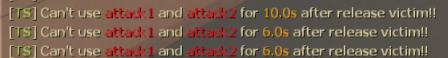

# Description | 內容
Allow to release victim

* [Video | 影片展示](https://youtu.be/IzL-UIF6K-Y)

* Image | 圖示
    * Press Right Mouse to release the victim (右鍵釋放抓住的倖存者)
    <br/>
    * Can't use attack1 and attack2 for short time after release victim (釋放後短時間不能攻擊)
    <br/>

* Require | 必要安裝
    1. [left4dhooks](https://forums.alliedmods.net/showthread.php?t=321696)
    2. [[INC] Multi Colors](https://github.com/fbef0102/L4D1_2-Plugins/releases/tag/Multi-Colors)

* <details><summary>ConVar | 指令</summary>

    * cfg\sourcemod\l4d2_release_victim.cfg
        ```php
        // Release distance
        l4d2_release_victim_distance "900.0"

        // Release height
        l4d2_release_victim_height "600.0"

        // Reset ability
        l4d2_release_victim_ability_reset "1"

        // Show effect after release
        l4d2_release_victim_effect "1"

        // After dismounting with the jockey, how long can the player not use attack1 and attack2
        l4d2_release_victim_jockey_attackdelay "6.0"

        // After dismounting with the hunter, how long can the player not use attack1 and attack2
        l4d2_release_victim_hunter_attackdelay "6.0"

        // After dismounting with the charger, how long can the player not use attack1 and attack2
        l4d2_release_victim_charger_attackdelay "6.0"

        // After dismounting with the smoker, how long can the player not use attack1 and attack2
        l4d2_release_victim_smoker_attackdelay "10.0"

        // Changes how message displays. (0: Disable, 1:In chat, 2: In Hint Box, 3: In center text)
        l4d2_release_victim_announce_type "1"
        ```
</details>

* <details><summary>Command | 命令</summary>

    None
</details>

* Apply to | 適用於
    ```
    L4D2
    ```

* <details><summary>Translation Support | 支援翻譯</summary>

    ```
    English
    繁體中文
    简体中文
    ```
</details>

* <details><summary>Changelog | 版本日誌</summary>

    ```php
    //BHaType @ 2019~2022
    //Shadowysn @ 2022
    //HarryPotter @ 2022-2024
    ```
    * v1.1h (2023-2-6)
        * Use better way to release victim
        * Require left4dhooks
        * Fixed crash when map change

    * v1.0h (2023-4-11)
        * Translation Support
        * Add cvars, infected can't use attack1 and attack2 for short time after release victim.

    * v2.5 (2023-1-27)
        * [Shadowysn's fork](https://forums.alliedmods.net/showpost.php?p=2785929&postcount=25)
        * Remove Gamedata

    * v0.4
        * [Original Plugin by BHaType](https://forums.alliedmods.net/showthread.php?p=2676902)
</details>

- - - -
# 中文說明
特感可以釋放被抓住的倖存者

* 原理
    * Charger、Smoker、Jockey、Hunter抓住倖存者之後，可以按下右鍵釋放倖存者
    * AI 特感不適用

* <details><summary>指令中文介紹 (點我展開)</summary>

    * cfg\sourcemod\l4d2_release_victim.cfg
        ```php
        // 釋放倖存者後彈走的距離
        l4d2_release_victim_distance "900.0"

        // 釋放倖存者後彈走的高度
        l4d2_release_victim_height "600.0"

        // 為1時，釋放倖存者後，特感的能力CD重置
        l4d2_release_victim_ability_reset "1"

        // 為1時，釋放倖存者時，顯示白光特效
        l4d2_release_victim_effect "1"

        // Jockey釋放倖存者後不能攻擊的時間
        l4d2_release_victim_jockey_attackdelay "6.0"

        // Hunter釋放倖存者後不能攻擊的時間
        l4d2_release_victim_hunter_attackdelay "6.0"

        // Charger釋放倖存者後不能攻擊的時間
        l4d2_release_victim_charger_attackdelay "6.0"

        // Smoker釋放倖存者後不能攻擊的時間
        l4d2_release_victim_smoker_attackdelay "10.0"

        // 提示該如何顯示. (0: 不提示, 1: 聊天框, 2: 黑底白字框, 3: 螢幕正中間)
        l4d2_release_victim_announce_type "1"
        ```
</details>