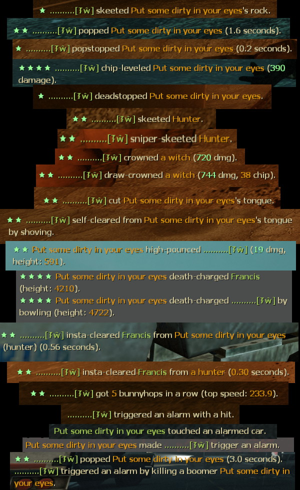

# Description | 內容
Detects and reports skeets, crowns, levels, highpounces, etc.

* Video | 影片展示
<br/>None

* Image
	* Skill moment
    <br/>  

* Require | 必要安裝
    1. [left4dhooks](https://forums.alliedmods.net/showthread.php?t=321696)
	2. [[INC] Multi Colors](https://github.com/fbef0102/L4D1_2-Plugins/releases/tag/Multi-Colors)

* <details><summary>ConVar | 指令</summary>

	* cfg/sourcemod/l4d2_skill_detect.cfg
		```php
        // Whether to report in chat (see sm_skill_report_flags).
        sm_skill_report_enable "1"

        // Report Flag
        // bitflags: 1,2:skeets/hurt; 4,8:level/chip; 16,32:crown/draw; 64,128:cut/selfclear, ...
        // See Source code for more bitflags.
        sm_skill_report_flags "2076671"

        // Whether to count/forward shotgun skeets.
        sm_skill_skeet_shotgun "1"

        // Whether to count/forward magnum pistol skeets.
        sm_skill_skeet_magnum "1"

        // Whether to count/forward melee skeets.
        sm_skill_skeet_melee "1"

        // Whether to count/forward sniper as skeets.
        sm_skill_skeet_sniper "1"

        // Whether to count/forward direct grenade launcher hits as skeets.
        sm_skill_skeet_grenade_launcher "1"

        // How much damage a survivor must at least do in the final shot for it to count as a drawcrown.
        sm_skill_drawcrown_damage "500"

        // How much damage a survivor must at least do to a smoker for him to count as self-clearing.
        sm_skill_selfclear_damage "200"

        // Minimum height of hunter pounce for it to count as a DP.
        sm_skill_hunterdp_height "400"

        // How much height distance a jockey must make for his 'DP' to count as a reportable highpounce.
        sm_skill_jockeydp_height "300"

        // If set, any damage done that exceeds the health of a victim is hidden in reports.
        sm_skill_hidefakedamage "1"

        // How much height distance a charger must take its victim for a deathcharge to be reported.
        sm_skill_deathcharge_height "400"

        // A clear within this time (in seconds) counts as an insta-clear.
        sm_skill_instaclear_time "0.75"

        // The lowest bunnyhop streak that will be reported.
        sm_skill_bhopstreak "3"

        // The minimal speed of the first jump of a bunnyhopstreak (0 to allow 'hops' from standstill).
        sm_skill_bhopinitspeed "150"

        // The minimal speed at which hops are considered succesful even if not speed increase is made.
        sm_skill_bhopkeepspeed "300"

        // How many survivors a boomer must at least vomit to count as wonderful-vomit.
        sm_skill_vomit_number "4"
		```
</details>

* <details><summary>Command | 命令</summary>

	None
</details>

* <details><summary>API | 串接</summary>

	```c
	forward void OnSkeet( int survivor, int vicitm, bool isHunter )

	forward void OnSkeetMelee( int survivor, int vicitm, bool isHunter )
    
    forward void OnSkeetSniper( int survivor, int vicitm, bool isHunter )

    forward void OnSkeetMagnum( int survivor, int vicitm, bool isHunter )

    forward void OnSkeetShotgun( int survivor, int vicitm, bool isHunter )

    forward void OnSkeetGL( int survivor, int vicitm, bool isHunter )

    forward void OnSkeetHurt( int survivor, int vicitm, int damage, bool isOverkill, bool isHunter )
    
    forward void OnSkeetMeleeHurt( int survivor, int vicitm, int damage, bool isOverkill, bool isHunter )

    forward void OnSkeetSniperHurt( int survivor, int vicitm, int damage, bool isOverkill, bool isHunter )

    forward void OnSkeetMagnumHurt( int survivor, int vicitm, int damage, bool isOverkill, bool isHunter )

    forward void OnSkeetShotgunHurt( int survivor, int vicitm, int damage, bool isOverkill, bool isHunter )

    forward void OnHunterDeadstop( int survivor, int hunter )

    forward void OnJocekyDeadstop( int survivor, int joceky )

    forward void OnBoomerPop( int survivor, int boomer, int shoveCount, float timeAlive )

    forward void OnChargerLevel( int survivor, int charger )

    forward void OnChargerLevelHurt( int survivor, int charger, int damage )

    forward void OnWitchCrown( int survivor, int damage )

    forward void OnWitchDrawCrown( int survivor, int damage, int chipdamage )

    forward void OnTongueCut( int survivor, int smoker )

    forward void OnSmokerSelfClear( int survivor, int smoker, bool withShove )

    forward void OnTankRockSkeeted( int survivor, int tank )

    forward void OnTankRockEaten( int tank, int survivor )

    forward void OnHunterHighPounce( int hunter, int victim, int actualDamage, float calculatedDamage, float height, bool bReportedHigh, bool bPlayerIncapped )

    forward void OnJockeyHighPounce( int jockey, int victim, float height, bool bReportedHigh )

    forward void OnDeathCharge( int charger, int victim, float height, float distance, bool wasCarried )

    forward void OnSpecialShoved( int survivor, int infected, int zombieClass )

    forward void OnSpecialClear( int clearer, int pinner, int pinvictim, int zombieClass, float timeA, float timeB, bool withShove )

    forward void OnBoomerVomitLanded( int boomer, int amount )

    forward void OnBunnyHopStreak( int survivor, int streak, float maxVelocity )

	/**
	* @brief Called whenever the survivor trigger the alarm car
	* 
	* @param survivor   the survivor
	* @param infected   the infected if was because the infected, value could be 0
	* @param reason     the reason why alaram was triggered, 0 = CALARM_UNKNOWN, 1 = CALARM_HIT, 2 = CALARM_TOUCHED, 3 = CALARM_EXPLOSION, 4 = CALARM_BOOMER
	*
    * @noreturn
	*/
    forward void OnCarAlarmTriggered( int survivor, int infected, int reason )
	```
</details>

* Apply to | 適用於
	```
	L4D2 Coop/Versus/Survival/Realism
	```

* <details><summary>Translation Support | 支援翻譯</summary>
	
    ```
	English
	繁體中文
	简体中文
	```
</details>

* <details><summary>Changelog | 版本日誌</summary>

    * v1.5h (2023-9-20)
        * Add Shotugn, magnum skeet cvars and api

    * v1.4h (2023-5-26)
        * Safely check client id when pass by timer

    * v1.3h (2023-4-28)
        * Add More Api

    * v1.2h (2023-3-24)
        * Separate translation for the jockey and hunter
		* Fixed Self clear, fast clear smoker tongue in versus/survival/cavenge
        * New Skill Reqport, "boomer vomits all survivors"

    * v1.1h (2022-12-16)
        * Request by Yabi
        * Translation Support

    * v0.9.20 fork
        * [By zonde306](https://github.com/zonde306/l4d2sc/blob/master/l4d2_skill_detect.sp)

    * v0.9.20
        * [SirPlease/l4d2_skill_detect](https://github.com/SirPlease/L4D2-Competitive-Rework/blob/master/addons/sourcemod/scripting/l4d2_skill_detect.sp)
</details>

- - - -
# 中文說明
顯示人類與特感各種花式技巧 (譬如推開特感、速救隊友、一槍爆頭、近戰砍死、高撲傷害等等)

* 圖示
	* 大佬裝B的瞬間
    <br/>  

* 原理
	* 每當有高手展現實力，打印在聊天視窗
    * 戰役/對抗/寫實/生存都適用

* <details><summary>指令中文介紹 (點我展開)</summary>

	* cfg/sourcemod/l4d2_skill_detect.cfg
		```php
        // 為1時，打印大佬裝B的各種特殊技巧 (查看指令 sm_skill_report_flags).
        sm_skill_report_enable "1"

        // 控制此指令選擇打印哪些特殊技巧 (請查看中文說明書教學)
        // bitflags: 1,2:skeets/hurt; 4,8:level/chip; 16,32:crown/draw; 64,128:cut/selfclear, ...
        // 源碼內查看 bitflags.
        sm_skill_report_flags "2076671"

        // 為1時，打印 散彈槍空爆 並輸出API
        sm_skill_skeet_shotgun "1"

        // 為1時，打印 手槍麥格農空爆 並輸出API
        sm_skill_skeet_magnum "1"

        // 為1時，打印 近戰武器空爆 並輸出API
        sm_skill_skeet_melee "1"

        // 為1時，打印 狙擊槍空爆 並輸出API
        sm_skill_skeet_sniper "1"

        //  為1時，打印 榴彈發射器空爆 並輸出API
        sm_skill_skeet_grenade_launcher "1"

        // 超過多少傷害才算 "一槍殺死Witch"
        sm_skill_drawcrown_damage "500"

        // 超過多少傷害才算 "倖存者自解特感"
        sm_skill_selfclear_damage "200"

        // 超過多少高度才算 "Hunter高撲"
        sm_skill_hunterdp_height "400"

        // 超過多少高度才算 "Jockey高空騎到人類"
        sm_skill_jockeydp_height "300"

        // 為1時，隱藏超過特感血量的傷害
        sm_skill_hidefakedamage "1"

        // 超過多少高度才算 "Charger衝鋒帶走人類墬樓"
        sm_skill_deathcharge_height "400"

        // 從被特感抓到的0.75秒內拯救隊友才算 "快速拯救隊友"
        sm_skill_instaclear_time "0.75"

        // 跳超過幾次才算 "連跳"
        sm_skill_bhopstreak "3"

        // 跳躍起始速度超過多少才算 "連跳"
        sm_skill_bhopinitspeed "150"

        // 跳躍中途速度超過多少才算 "連跳"
        sm_skill_bhopkeepspeed "300"

        // Boomer一次吐到4位倖存者以上才算 "Boomer 完美嘔吐"
        sm_skill_vomit_number "4"
		```
</details>

* <details><summary>控制指令選擇打印哪些特殊技巧</summary>

    * 指令預設
        ```php
        // 此指令用來決定顯示哪些花式技巧
        // 2076671 = 1 + 2 + 4 + 8 + 16 + 32 + 64 + 128 + 256 + 512 + 1024 + 2048 + 8192 + 32768 + 65536 + 131072 + 262144 + 524288 + 1048576
        sm_skill_report_flags "2076671"
        ```

    * 源始碼內
        ```php
        REP_SKEET				(2 ^ 0 = 1) //空爆hunter/jokcey
        REP_HURTSKEET			(2 ^ 1 = 2) //空爆hunter/jokcey (傷害較低)
        REP_LEVEL				(2 ^ 2 = 4) //近戰砍死衝鋒的Charger
        REP_HURTLEVEL			(2 ^ 3 = 8) //近戰砍死衝鋒的Charger (傷害較低)
        REP_CROWN				(2 ^ 4 = 16) //一槍殺死Witch並無人受傷
        REP_DRAWCROWN			(2 ^ 5 = 32) //兩槍以上殺死Witch並無人受傷
        REP_TONGUECUT			(2 ^ 6 = 64)  //砍斷Smoker的舌頭
        REP_SELFCLEAR			(2 ^ 7 = 128) //自解Smoker的舌頭
        REP_SELFCLEARSHOVE		(2 ^ 8 = 256) //推開自解Smoker的舌頭
        REP_ROCKSKEET			(2 ^ 9 = 512) //打碎Tank石頭
        REP_DEADSTOP			(2 ^ 10 = 1024) //推停飛撲的hunter/jokcey
        REP_POP					(2 ^ 11 = 2048) //殺死Boomer不被嘔吐
        REP_SHOVE				(2 ^ 12 = 4096) //推開特感
        REP_HUNTERDP			(2 ^ 13 = 8192) //Hunter高撲傷害
        REP_JOCKEYDP			(2 ^ 14 = 16384) //Jockey高空騎到人類
        REP_DEATHCHARGE			(2 ^ 15 = 32768) //Charger衝鋒帶走人類墬樓
        REP_INSTACLEAR			(2 ^ 16 = 65536) //快速拯救隊友
        REP_BHOPSTREAK			(2 ^ 17 = 131072) //連跳
        REP_CARALARM			(2 ^ 18 = 262144) //警報車
        REP_POPSTOP				(2 ^ 19 = 524288) //推開Boomer不被嘔吐
        REP_VOMIT				(2 ^ 20 = 1048576) //Boomer 完美嘔吐 (一次吐到4位倖存者以上)
        ```

    * 舉例
        * 如果只要顯示 "打碎Tank石頭"(數值是512)、"Hunter高撲傷害"(數值是8192) => 請寫```sm_skill_report_flagss 8704```  (512 + 8192)
        * 如果只要顯示 "空爆hunter/jokcey"(數值是1)、"打碎Tank石頭"(數值是512)、"警報車"(數值是262144) => 請寫```sm_skill_report_flagss 262657```  (1 + 512 + 262144)
        * 如果要顯示全部，請寫```sm_skill_report_flags 2097151``` (總數值)
</details>