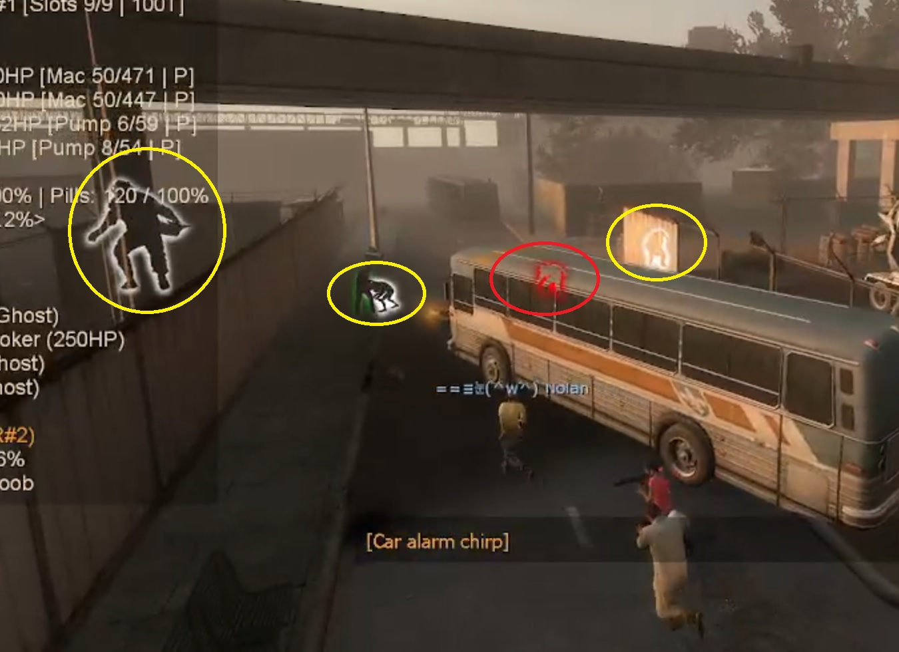
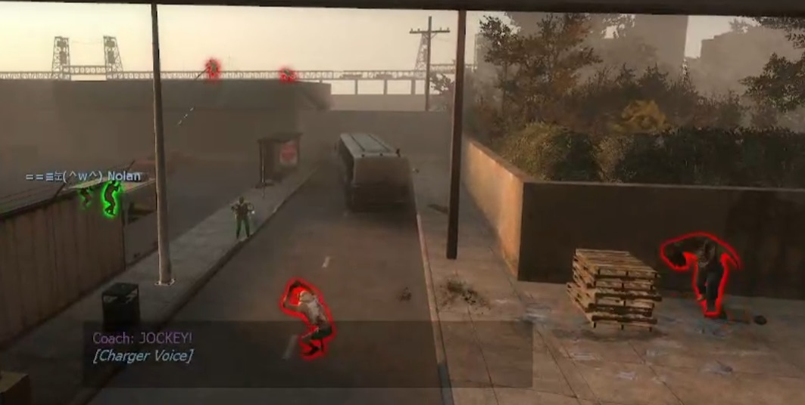

# Description | 內容
A spectator who watching the survivor at first person view can now see the infected model glows though the wall

* [Video | 影片展示](https://www.bilibili.com/video/BV1Xq4y1a7ie)

* Image | 圖示
    * White Glow=Ghost Infected, Red Glow=Alive Infected 
        > 白光=靈魂特感，紅光=活著的特感
        <br/>
    * Better view for spectator in versus match
        > 提高對抗模式觀賞性
        <br/>

* Apply to | 適用於
    ```
    L4D2
    ```

* <details><summary>Changelog | 版本日誌</summary>

    * v2.8 (2023-6-19)
        * Optimize code and improve performance

    * v2.6 (2023-2-4)
        * Remove glow if client leaves the game

    * v2.5 (2023-1-27)
        * Support [confoglcompmod Plugin](https://github.com/SirPlease/L4D2-Competitive-Rework/blob/master/addons/sourcemod/scripting/confoglcompmod/GhostTank.sp#L216): This plugin change tank into ghost state when tank spawns

    * v2.4 (2023-1-22)
        * Support [l4d2_profitless_ai_tank Plugin](https://github.com/SirPlease/L4D2-Competitive-Rework/blob/master/addons/sourcemod/scripting/l4d2_profitless_ai_tank.sp)

    * v2.3 (2022-12-5)
        * Support [Zombie Change Class Plugin](https://github.com/fbef0102/Game-Private_Plugin/tree/main/Plugin_%E6%8F%92%E4%BB%B6/Versus_%E5%B0%8D%E6%8A%97%E6%A8%A1%E5%BC%8F/l4d_zcs)

    * v2.2
        * Remake code
        * Alive SI glow color
        * Ghost SI glow color
        * Admin Flag to toggle Speatator watching cheat
        * Enable Speatator watching cheat for spectators default valve

    * v1.0
        * Initial Release
        * Request by Target_7
</details>

* Require | 必要安裝
<br/>None

* Similar Plugin | 相似插件
    1. [l4d2_wallhack_cheat](https://github.com/fbef0102/Game-Private_Plugin/tree/main/Plugin_%E6%8F%92%E4%BB%B6/Nothing_Impossible_%E7%84%A1%E7%90%86%E6%94%B9%E9%80%A0%E7%89%88/l4d2_wallhack_cheat): Admins can use commands to see the infected model glows though the wall
        > 管理員輸入指令能透視看到特感

* <details><summary>Related Plugin | 相關插件</summary>

    1. [l4d_flashlight_speconly](https://github.com/fbef0102/Game-Private_Plugin/tree/main/Plugin_%E6%8F%92%E4%BB%B6/Spectator_%E6%97%81%E8%A7%80%E8%80%85/l4d_flashlight_speconly): Attaches an extra flashlight to spectators and dead survivors.
        > 給死亡玩家或旁觀者手電筒，照亮地圖

    2. [l4d_versus_specListener](https://github.com/fbef0102/Game-Private_Plugin/tree/main/Plugin_%E6%8F%92%E4%BB%B6/Spectator_%E6%97%81%E8%A7%80%E8%80%85/l4d_versus_specListener): Allows spectator listen others team voice and see others team chat for l4d
        > 旁觀者可以透過聊天視窗看到倖存者和特感的隊伍對話，亦可透過音頻聽到隊伍談話

    3. [HP Sprite](https://forums.alliedmods.net/showthread.php?p=2735149): Shows a sprite at the client head based on its HP
        > 頭上有血量提示，給旁觀者更好的觀賞性

    4. [l4d2healthglow](https://github.com/fbef0102/Game-Private_Plugin/tree/main/Plugin_%E6%8F%92%E4%BB%B6/Survivor_%E4%BA%BA%E9%A1%9E/l4d2healthglow): Gives the Survivors a health glow around them + For the infected, survivors always glow with a non-disappearing aura. (Even if survivor doesn't move or walk)
        > 根據玩家生命值狀態給予輪廓光圈適當的顏色 + 對抗模式中，特感永遠能看到人類光圈 (即使人類靜走或不動)
</details>

* <details><summary>ConVar | 指令</summary>

    * cfg\sourcemod\l4d2_specting_cheat.cfg
        ```php
        // Alive SI glow color, Three values between 0-255 separated by spaces. RGB Color255 - Red Green Blue.
        l4d2_specting_cheat_alive_color "255 0 0"

        // Enable Speatator watching cheat for spectators default? [1-Enable/0-Disable]
        l4d2_specting_cheat_default_value "0"

        // Ghost SI glow color, Three values between 0-255 separated by spaces. RGB Color255 - Red Green Blue.
        l4d2_specting_cheat_ghost_color "255 255 255"

        // Players with these flags have access to use command to toggle Speatator watching cheat. (Empty = Everyone, -1: Nobody)
        l4d2_specting_cheat_use_command_flag "z"
        ```
</details>

* <details><summary>Command | 命令</summary>

    * **Toggle Speatator watching cheat (spectator only)**
        ```php
        sm_speccheat
        sm_watchcheat
        sm_lookcheat
        sm_seecheat
        sm_meetcheat
        sm_starecheat
        sm_hellocheat
        sm_areyoucheat
        sm_fuckyoucheat
        sm_zzz
        ```
</details>

- - - -
# 中文說明
旁觀者可以看到特感的光圈，方便旁觀者觀賞

* 原理
    * 生成特感或變成靈魂特感時在特感玩家身上創造光圈，只有旁觀者能看見
    * 即使旁觀者觀看人類視角第一人稱，也能看到特感光圈
    * 此插件本意只是拿來抓鬼(偷看倖存者誰開了透視外掛)，誰知道意外地提供了旁觀者非常好的觀賞性(被各個對抗伺服器拿去用)

* 功能
    * 特定權限的人可以使用指令關閉或開啟光圈
    * 可調整預設所有旁觀者能看到
    * 可調整活著的特感與靈魂特感的顏色
