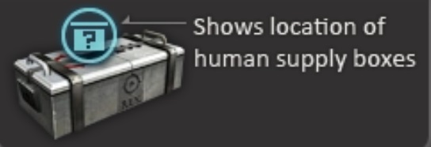
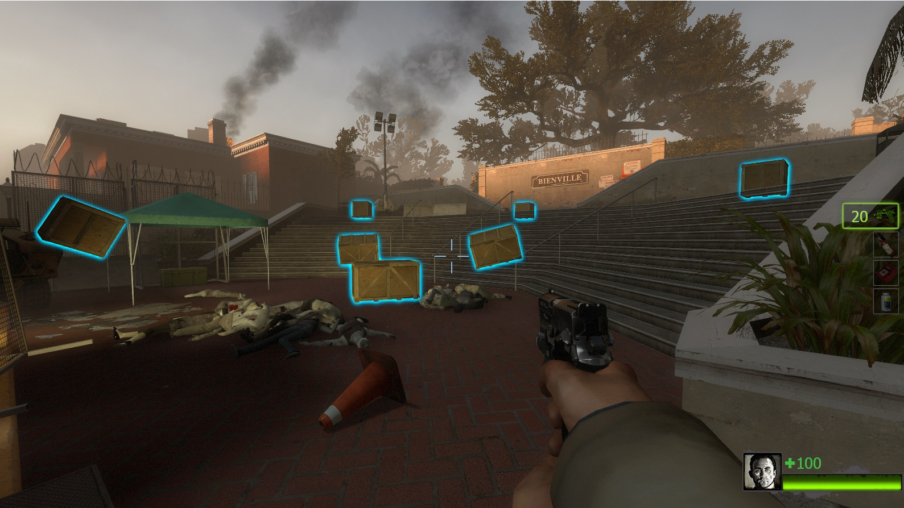

# Description | 內容
Supply boxes are dropped randomly in the map every certain seconds to provide support for the fight against the zombies.

* [Video | 影片展示](https://youtu.be/9rXlJ8PsOTA)

* Image | 圖示
	* Idea comes from [Counter Strike Online Human Supply boxes](https://cso.fandom.com/wiki/Zombie_2:_Mutation#Supply_boxes)
	* They contain several types of weapons or items inside, depending on the cvar you set.
	<br/>
	<br/>

* Require | 必要安裝
	1. [left4dhooks](https://forums.alliedmods.net/showthread.php?t=321696)

* <details><summary>How does it work?</summary>

	* Drop supply box after survivos has left the safer zone
	* Drop weapons, melee (support custom melee), medic, throwable, gascan....
	* Sometime the helicopter pilot might lose his way, drop supply box on unreachable location and outside of the path.
</details>

* <details><summary>ConVar</summary>

	* cfg\sourcemod\l4d2_supply_woodbox.cfg
		```php
		// 0=Plugin off, 1=Plugin on.
		l4d2_supply_woodbox_allow "1"

		// Turn on the plugin in these game modes, separate by commas (no spaces). (Empty = all).
		l4d2_supply_woodbox_modes ""

		// Turn off the plugin in these game modes, separate by commas (no spaces). (Empty = none).
		l4d2_supply_woodbox_modes_off ""

		// Turn on the plugin in these game modes. 0=All, 1=Coop, 2=Survival, 4=Versus, 8=Scavenge. Add numbers together.
		l4d2_supply_woodbox_modes_tog "0"

		// Turn off the plugin in these maps, separate by commas (no spaces). (0=All maps, Empty = none).
		l4d2_supply_woodbox_map_off ""

		// Max Items that could drop in woodbox.
		l4d2_supply_woodbox_item_max "4"

		// Min Items that could drop in woodbox.
		l4d2_supply_woodbox_item_min "2"

		// Item chance to drop Weapons/Melee/Medic/Throwable/Others, separate by commas (no spaces), the sum of 5 value must be 100
		l4d2_supply_woodbox_item_chance "30,5,45,15,5"

		// Time in seconds to remove item if no one picks up after it drops from box (0=off)
		l4d2_supply_woodbox_item_life "60"

		// The default Supply box color. Three values between 0-255 separated by spaces. RGB Color255 - Red Green Blue. (empty=disable)
		l4d2_supply_woodbox_color "0 145 200"

		// The default Supply box glow range.
		l4d2_supply_woodbox_glow_range "1800"

		// Set the max spawn time for Supply box drop.
		l4d2_supply_woodbox_time_max "80"

		// Set the min spawn time for Supply box drop.
		l4d2_supply_woodbox_time_min "60"

		// Max Supply boxes that could drop once.
		l4d2_supply_woodbox_drop_max "2"

		// Min Supply boxes that could drop once.
		l4d2_supply_woodbox_drop_min "1"

		// Set the limit for Supply box spawned by the plugin.
		l4d2_supply_woodbox_limit "6"

		// Set the life time for Supply box.
		l4d2_supply_woodbox_box_life "180"

		// Supply Box - Drop sound file (relative to to sound/, empty=random helicopter sound, -1: disable)
		l4d2_supply_woodbox_soundfile ""

		// If 1, still dorp supply box in final stage rescue
		l4d2_supply_woodbox_drop_final "0"

		// Supply box model type, 1: wood_crate001a, 2: wood_crate001a_damagedMAX, 3: wood_crate002a (0=random)
		l4d2_supply_woodbox_type "1"

		// Changes how Supply box hint displays. (0: Disable, 1:In chat, 2: In Hint Box, 3: In center text)
		l4d2_supply_woodbox_announce_type "3"
		```
</details>

* <details><summary>Command</summary>

	* **Spawn a supply box at your crosshair (Admin Flag: ADMFLAG_ROOT)**
		```php
		sm_supplybox
		sm_box
		```
</details>

* <details><summary>Data Config</summary>

	* Check ```data/l4d2_supply_woodbox.txt``` for more details
		```php
		"l4d2_supply_woodbox"
		{
			"Weapons"
			{
				// There are 14 random weapons drop from supply box
				"num"   "14"
				"1"
				{
					"name" "weapon_rifle"
					"ammo_min" "200" // random ammo (minimum)
					"ammo_max" "360" // random ammo (maximum)
				}

				...
			}
		}
		```

	* Available Weapons
		```php
		"weapon_weapon_grenade_launcher" => Grenade Launcher
		"weapon_rifle_m60" => M60 Machine Gun
		"weapon_pistol" => Pistol
		"weapon_pistol_magnum" => Magnum
		"weapon_pumpshotgun" => Pumpshotgun
		"shotgun_chrome" => Chrome Shotgun
		"weapon_smg" => Smg
		"weapon_smg_silenced" => Silenced Smg
		"weapon_smg_mp5" => MP5
		"weapon_rifle" => Rifle
		"weapon_rifle_sg552" => SG552
		"weapon_rifle_ak47" => AK47
		"weapon_rifle_desert" => Desert Rifle
		"weapon_shotgun_spas" => Spas Shotgun
		"weapon_autoshotgun" => Autoshotgun
		"weapon_hunting_rifle" => Hunting Rifle
		"weapon_sniper_military" => Military Sniper
		"weapon_sniper_scout" => SCOUT
		"weapon_sniper_awp" => AWP
		"weapon_chainsaw" => Chainsaw
		```

	* Available Medic
		```php
		"weapon_defibrillator" => Defibrillator
		"weapon_first_aid_kit" => First Aid Kit
		"weapon_pain_pills" => Pain Pill
		"weapon_adrenaline" => Adrenaline
		```

	* Available Throwable
		```php
		"weapon_molotov" => Molotov
		"weapon_weapon_pipe_bomb" => Pipe Bomb
		"weapon_vomitjar" => Vomitjar
		```

	* Avaible Others
		```php
		"weapon_gascan" => Gascan
		"weapon_propanetank" => Propane Tank
		"weapon_oxygentank" => Oxygen Tank
		"weapon_fireworkcrate" => Firework Crate
		"weapon_gnome" => Gnome
		"weapon_cola_bottles" => Cola Bottles
		"weapon_upgradepack_incendiary" => Incendiary Pack
		"weapon_upgradepack_explosive" => Explosive Pack
		```
</details>

* Apply to | 適用於
	```
	L4D2
	```

* <details><summary>Translation Support | 支援翻譯</summary>

	```
	English
	繁體中文
	简体中文
	Русский
	```
</details>

* <details><summary>Related Plugin | 相關插件</summary>

	1. [l4d_cso_zombie_Regeneration](https://github.com/fbef0102/L4D1_2-Plugins/tree/master/l4d_cso_zombie_Regeneration): The zombies have grown stronger, now they are able to heal their injuries by standing still without receiving any damage.
		* 殭屍變得更強大，他們只要站著不動便可以自癒傷勢　(仿CSO惡靈降世 殭屍技能)

	2. [weapon_csgo_reload](https://github.com/fbef0102/L4D2-Plugins/tree/master/l4d2_weapon_csgo_reload): Weapon Quickswitch Reloading in L4D1+2
		* 將武器改成現代遊戲的裝子彈機制 (仿CS:GO切槍裝彈設定)

	3. [l4d2_cso_knockback](https://github.com/fbef0102/Game-Private_Plugin/tree/main/Plugin_插件/Nothing_Impossible_無理改造版/l4d2_cso_knockback): Weapons and Melees now have knockback power like CSO
		* 槍械與近戰武器現在有擊退力 (仿CSO惡靈降世)
</details>

* <details><summary>Changelog | 版本日誌</summary>

	* v1.6 (2024-3-1)
		* Update data
		* Infected team now unable to see the box glow
		
	* v1.5 (2024-2-15)
		* Add data config

	* v1.4 (2023-7-26)
		* Add hunting Rifle

	* v1.3 (2022-9-12)
		* Remove gascan,  propanecanister, oxygentank if no one picks up

	* v1.2 (2022-8-13)
		* Optimize code.

	* v1.1 (2022-3-29)
		* Support Survival Mode.

	* v1.0 (2022-1-11)
		* [Initial release](https://forums.alliedmods.net/showthread.php?t=335862)
		* Add convars to turn off this plugin
		* Random box model available
		* Item chance to drop Weapons/Melee/Medic/Throwable/Others
		* Custom sound
		* Detect custom melee and spawn
		* Translation Support
		* Supply box life time
		* Remove item if no one picks up after it drops from box after a while
		* Compatibility support for SourceMod 1.11. Fixed various warnings.

	* v0.0
		* Credit: [Lux](https://forums.alliedmods.net/member.php?u=257841) - original code
</details>

- - - -
# 中文說明
地圖上隨機出現補給箱，提供人類強力支援 (仿CSO惡靈降世 補給箱)

* 原理
	* 靈感來自CSO 殭屍模式，離開安全室之後每隔一段時間地圖上出現補給箱
		* 補給箱內有物資與武器 (支援三方圖近戰)
	* 地圖上隨機出現補給箱，只有人類才能看到補給箱位置
	* 打開補給箱方式 (特感無法打開)
		* 用子彈射擊
		* 近戰武器打破
		* 對著補給箱按E
	* 補給箱不會擋住特感與普通感染者，他們可以穿透
	* 有時候空投的補給箱出現在人類無法到達的區域，譬如屋頂。認真你就輸了，問就是飛行員迷路

* <details><summary>指令中文介紹 (點我展開)</summary>

	* cfg\sourcemod\l4d2_supply_woodbox.cfg
		```php
		// 0=關閉插件, 1=啟動插件
		l4d2_supply_woodbox_allow "1"

		// 什麼模式下啟動此插件, 逗號區隔 (無空白). (留白 = 所有模式)
		l4d2_supply_woodbox_modes ""

		// 什麼模式下關閉此插件, 逗號區隔 (無空白). (留白 = 無)
		l4d2_supply_woodbox_modes_off ""

		// 什麼模式下啟動此插件. 0=所有模式, 1=戰役, 2=生存, 4=對抗, 8=清道夫. 請將數字相加起來
		l4d2_supply_woodbox_modes_tog "0"

		// 在某些地圖裡關閉此插件，請填入地圖名，逗號區隔 (無空白). (0 = 所有地圖, 留白 = 無)
		l4d2_supply_woodbox_map_off ""

		// 從補給箱掉落的物品最大數量.
		l4d2_supply_woodbox_item_max "4"

		// 從補給箱掉落的物品最小數量.
		l4d2_supply_woodbox_item_min "2"

		// 從補給箱掉落的物品，變成槍枝武器/近戰武器/醫療物品/投擲物品/其他(汽油桶、瓦斯罐...)的機率，逗號區隔 (無空白)，這五個數字加起來必須是100
		l4d2_supply_woodbox_item_chance "30,5,45,15,5"

		// 如果沒人拿取補給箱掉落的物品，過60秒後會自動移除 (0=不移除)
		l4d2_supply_woodbox_item_life "60"

		// 補給箱的光圈顏色. 三個介於0-255的數字，空白區隔. 為RGB三色 - 紅 綠 藍. (留白=沒有光圈顏色)
		l4d2_supply_woodbox_color "0 145 200"

		// 補給箱的光圈發光範圍.
		l4d2_supply_woodbox_glow_range "1800"

		// 空投補給箱的最大間隔時間
		l4d2_supply_woodbox_time_max "80"

		// 空投補給箱的最小間隔時間
		l4d2_supply_woodbox_time_min "60"

		// 每次空投補給箱的最多數量.
		l4d2_supply_woodbox_drop_max "2"

		// 每次空投補給箱的最少數量.
		l4d2_supply_woodbox_drop_min "1"

		// 場上只能同時存在6個補給箱.
		l4d2_supply_woodbox_limit "6"

		// 沒人打破補給箱的場合，180秒後會自動消失
		l4d2_supply_woodbox_box_life "180"

		// 補給箱空投音效 (路徑相對於 sound 資料夾, 留白=隨機的直升機駕駛員語音, -1=關閉音效)
		l4d2_supply_woodbox_soundfile ""

		// 為1時，最後救援開始之後，照樣空投補給箱
		l4d2_supply_woodbox_drop_final "0"

		// 補給箱的箱子模型, 1: wood_crate001a, 2: wood_crate001a_damagedMAX, 3: wood_crate002a (0=隨機模型)
		l4d2_supply_woodbox_type "1"

		// 如何提示有空投補給箱?. (0: 不提示, 1: 聊天框, 2: 螢幕下方黑底白字框, 3: 螢幕正中間)
		l4d2_supply_woodbox_announce_type "3"
		```
</details>

* <details><summary>命令中文介紹 (點我展開)</summary>

	* **在準心指向的地方生成補給箱 (管理員權限: ADMFLAG_ROOT)**
		```php
		sm_supplybox
		sm_box
		```
</details>

* <details><summary>文件設定範例</summary>

	* 查看```data/l4d2_supply_woodbox.txt```有更多說明
	* 修改掉落的物資
		```php
		"l4d2_supply_woodbox"
		{
			"Weapons"
			{
				// 有14種武器隨機從補給箱掉落
				"num"   "14"
				"1"
				{
					"name" "weapon_rifle"
					"ammo_min" "200" // 武器的備用子彈隨機數值 (最小)
					"ammo_max" "360" // 武器的備用子彈隨機數值 (最大)
				}

				...
			}
		}
		```

	* 可寫入的武器名稱
		```php
		"weapon_weapon_grenade_launcher" => 榴彈發射器
		"weapon_rifle_m60" => M60 機關槍
		"weapon_pistol" => Pistol
		"weapon_pistol_magnum" => Magnum
		"weapon_pumpshotgun" => Pumpshotgun
		"shotgun_chrome" => Chrome Shotgun
		"weapon_smg" => Smg
		"weapon_smg_silenced" => Silenced Smg
		"weapon_smg_mp5" => MP5
		"weapon_rifle" => Rifle
		"weapon_rifle_sg552" => SG552
		"weapon_rifle_ak47" => AK47
		"weapon_rifle_desert" => Desert Rifle
		"weapon_shotgun_spas" => Spas Shotgun
		"weapon_autoshotgun" => Autoshotgun
		"weapon_hunting_rifle" => Hunting Rifle
		"weapon_sniper_military" => Military Sniper
		"weapon_sniper_scout" => SCOUT
		"weapon_sniper_awp" => AWP
		"weapon_chainsaw" => Chainsaw
		```

	* 可寫入的醫療物品名稱
		```php
		"weapon_defibrillator" => 電擊器
		"weapon_first_aid_kit" => 治療包
		"weapon_pain_pills" => 藥丸
		"weapon_adrenaline" => 腎上腺素
		```

	* 可寫入的投擲物品名稱
		```php
		"weapon_molotov" => 火瓶
		"weapon_weapon_pipe_bomb" => 土製炸彈
		"weapon_vomitjar" => 膽汁瓶
		```

	* 可寫入的其物品名稱
		```php
		"weapon_gascan" => 汽油桶
		"weapon_propanetank" => 瓦斯桶
		"weapon_oxygentank" => 氧氣灌
		"weapon_fireworkcrate" => 煙火盒
		"weapon_gnome" => 精靈小矮人
		"weapon_cola_bottles" => 可樂瓶
		"weapon_upgradepack_incendiary" => 火焰彈藥包
		"weapon_upgradepack_explosive" => 高爆彈藥包
		```
</details>
