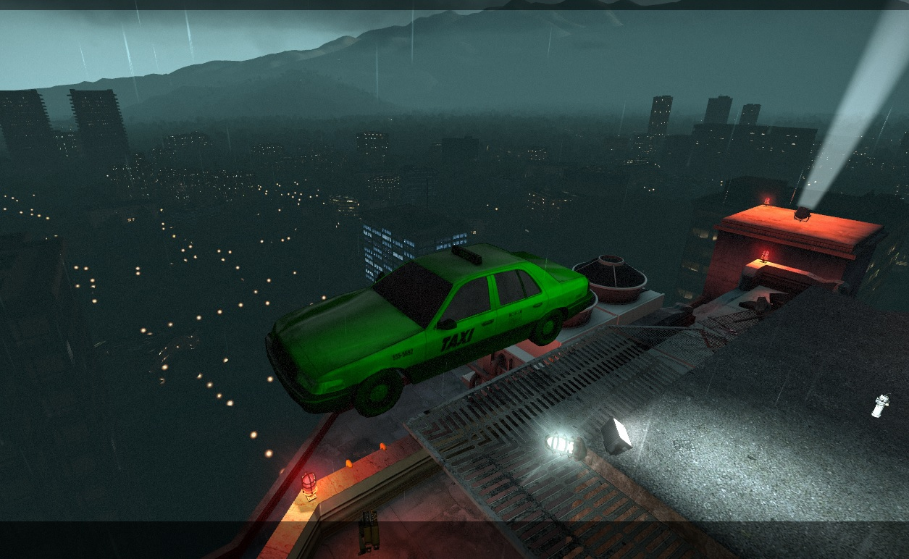

# Description | 內容
Replaces getaway chopper by flying car in L4D2 C8 No Mercy


* Video | 影片展示
<br/>None

* Image | 圖示
	* It's time to Hogwarts School
		> 出發前往霍格華茲學院
		<br/>
	* Magic Car
		> 魔法汽車
		<br/>
		<br/>

* Apply to | 適用於
	```
	L4D2
	```

* <details><summary>Changelog | 版本日誌</summary>

	* v1.4 (2023-2-18)
	    * Remake codes to make it work in l4d2
	    * Map name check after c8m5

	* v1.0
	    * [Original Plugin by axelnieves2012](https://forums.alliedmods.net/showthread.php?p=2694666)
</details>

* Require | 必要安裝
<br/>None

* <details><summary>ConVar | 指令</summary>

	* cfg/sourcemod/l4d_flying_car.cfg
		```php
        // Custom color (rgb), leave black to use default color
        l4d_flying_car_color ""

        // Enable/Disable this plugin. 0:disable, 1:enable
        l4d_flying_car_enable "1"

        // Explode car? 0:disable, 1:enable
        l4d_flying_car_explode "1"

        // Ignite car on leaving? 0:disable, 1:enable
        l4d_flying_car_ignite "1"

        // Car model (1:taxi, 2:police car)
        l4d_flying_car_model "1"

        // Choose color randomly instead using custom one? 0:disable, 1:enable
        l4d_flying_car_random_color "1"

        // Choose model randomly instead using custom one? 0:disable, 1:enable
        l4d_flying_car_random_model "1"
		```
</details>

* <details><summary>Command | 命令</summary>

    None
</details>

- - - -
# 中文說明
前往霍格華茲學院的魔法汽車

* 原理
	* 將毫不留情最後一關(C8M5)直升機替換成汽車

* 功能
	* 設置隨機的車子顏色
    * 設置隨機的車子模型
