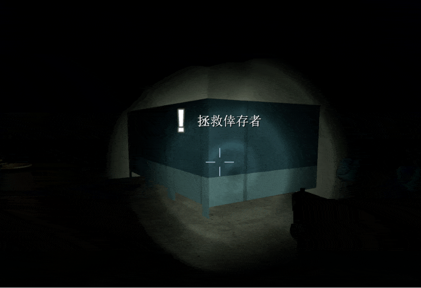
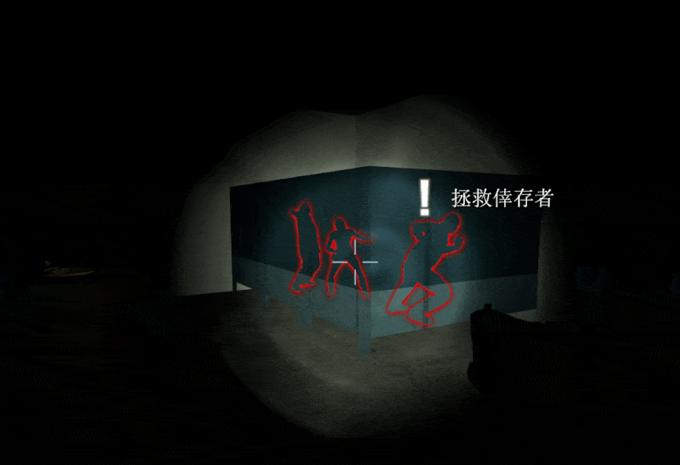

# Description | 內容
Fixed sometimes glow is invisible when dead survivors appears in rescue closet

* Video | 影片展示
<br/>None

* Image | 圖示
	* Before (裝此插件之前)
	<br/>
	* After (裝此插件之後)
	<br/>|

* <details><summary>How does it work?</summary>

	* (Before) When bots take over dead player, or player takes over dead bot, the glow will be invisible when in rescue closet
		* [Left 4 Dead 2: No Glow in Rescue Closet](https://steamcommunity.com/app/550/discussions/0/1643170903495915797/)
	* (After) Make dead player glow appear when player is awaiting rescue
</details>

* Require | 必要安裝
<br/>None

* <details><summary>ConVar | 指令</summary>

    * cfg/sourcemod/rescue_glow.cfg
        ```php
		// 0=Plugin off, 1=Plugin on.
		rescue_glow_enable "1"

		// Color of survivor glow in rescue closet, Three values between 0-255 separated by spaces. RGB Color255 - Red Green Blue.
		rescue_glow_color "255 102 0"

		// If 1, Glow will be flashing
		rescue_glow_flash "1"
        ```
</details>

* <details><summary>Command | 命令</summary>

	None
</details>

* <details><summary>API | 串接</summary>

	* [rescue_glow.inc](scripting\include\rescue_glow.inc)
		```php
		library name: rescue_glow
		```
</details>

* Apply to | 適用於
	```
	L4D2
	```

* <details><summary>Changelog | 版本日誌</summary>

	* v1.0h (2024-8-11)
		* Change another method to detect if dead survivor apprears in rescue closet.
		* Avoid to use PostThinkPost, cost cpu a lot every game frame
		* Update cvars

	* v2.3
		* [Original plugin by little_froy](https://forums.alliedmods.net/showthread.php?t=348762)
</details>

- - - -
# 中文說明
修復有時候救援房間沒有看到倖存者的光圈

* 原理
	* (裝插件之前) 當真人玩家取代死亡bot，或死亡的真人玩家離開遊戲，他的光圈會在救援房消失
	* (裝插件之後) 當玩家等待救援時，強制身體發光

* <details><summary>指令中文介紹 (點我展開)</summary>

    * cfg/sourcemod/rescue_glow.cfg
        ```php
		// 0=關閉插件, 1=啟動插件
		rescue_glow_enable "1"

		// 等待救援時光圈的顏色，填入RGB三色 (三個數值介於0~255，需要空格) [-1: 隨機顏色]
		rescue_glow_color "255 102 0"

		// 為1時，光圈會閃爍
		rescue_glow_flash "1"
        ```
</details>