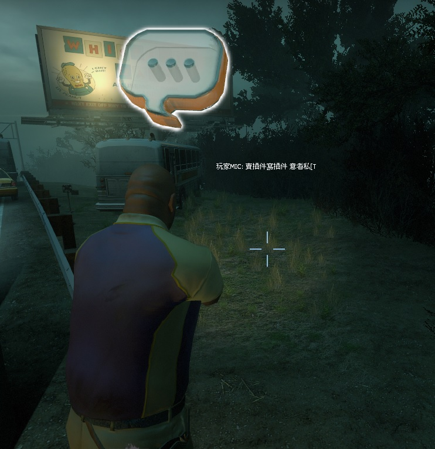

# Description | 內容
Voice Announce in centr text + create hat to Show Who is speaking.

* Video | 影片展示
<br/>None

* Image | 圖示
	* hat + text
    > MIC說話的玩家頭上會有對話框
	  <br/>

* Apply to | 適用於
```
L4D2
```

* <details><summary>Changelog | 版本日誌</summary>

	* v1.8 (2022-12-1)
    * Remove voicehook (voicehook is now included with SourceMod 1.11)

	* v1.7
    * Remake Code

	* v1.8
    * [foxhound27's fork](https://forums.alliedmods.net/showpost.php?p=2671963&postcount=7)
</details>

* Require | 必要安裝
	1. [left4dhooks](https://forums.alliedmods.net/showthread.php?t=321696)
	2. [[INC] Multi Colors](https://github.com/fbef0102/L4D1_2-Plugins/releases/tag/Multi-Colors)
	3. [ThirdPersonShoulder_Detect](https://forums.alliedmods.net/showthread.php?p=2529779)

* <details><summary>ConVar | 指令</summary>

	* cfg\sourcemod\show_mic.cfg
    ```php
    // If 1, display hat on player's head if player is speaking
    show_mic_center_hat_enable "1"

    // If 1, display player speaking message in center text
    show_mic_center_text_enable "1"
    ```
</details>

* <details><summary>Command | 命令</summary>

	None
</details>

- - - -
# 中文說明
顯示誰在語音並且在說話的玩家頭上帶帽子

* 原理
    * 當玩家在遊戲中使用麥克風說話時，頭上產生對話框的模組
    * 當玩家在遊戲中使用麥克風說話時，顯示提示在螢幕中心

* 功能
    * 可開啟或關閉帽子模組
    * 可開啟或關閉語音提示